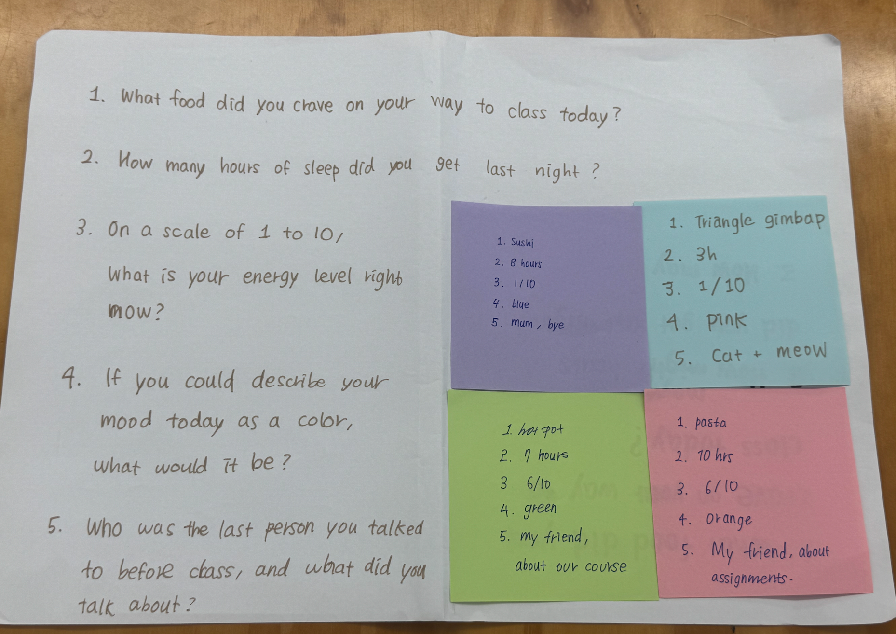
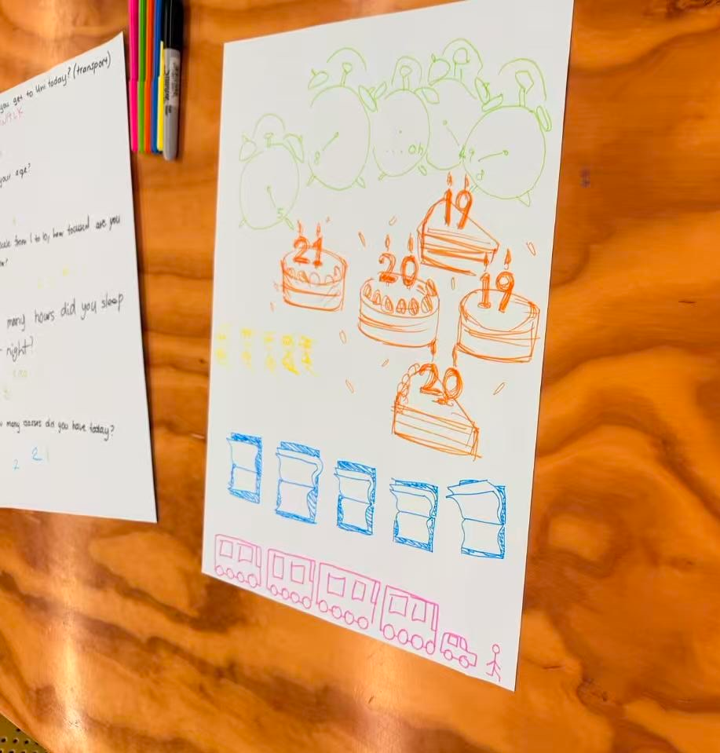
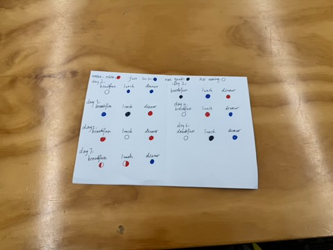

# Week 01

[← Back to Home](../index.md)

##  In-Class Activity – Group Data Portrait
### 1. Process: Collect

We formed a group of four and began by devising a short questionnaire. We wanted questions that would reveal something personal but light‑hearted, in the spirit of “data humanism” (Giorgia Lupi’s idea that data can include empathy and imperfection). After brainstorming, we settled on these five:

- **1.What food did you have on your way to class today?**

- **2.How many hours of sleep did you get last night?**

- **3.On a scale of 1 to 10, what is your energy level right now?**

- **4.If you could describe your mood today as a color, what would it be?**

- **5.Who was the last person you talked to before class, and what did you talk about?**

Each person wrote their own answers on separate post‑it notes, anonymously. We then gathered all post‑its and transcribed the data onto a shared sheet to make it visible.

### 2.Process: Visualise
We brainstormed how to visually represent each person using the collected data.  We wanted a system that would let viewers decode the drawing without needing names.

**Decisions:** Our group chose to use the image of a bowl. Bowls have different shapes. The color represents the color of mood. The food in the bowl is the food we want to eat today. The quantity of food represents the score of mood. The number of patterns on the bowl represents the time to sleep. The language of the characters is the topic we will discuss at the end of the day. 

## Independent Study – Personal Data Portrait
### 1.Data collection 
I chose to collect information about "the deliciousness of the food I eat every day" within a week. Because the thing that makes me happiest every day is to eat delicious food, I really want to record the data in this regard. I often get happy for a whole day because of eating delicious food. I brought a piece of paper and a pen. Every time I finish a meal, I will write it down.
###  2.Data visualization
I used a larger piece of white paper and three pens of different colors. Black represents not very tasty, blue represents average, and red represents delicious. I thanked for breakfast and lunch respectively, and then drew my records in the corresponding places every day. Where there is no painting, it means there is no food. There was a situation where it was half done because I had brunch that day.
### 3.Reflection
- **Why choose "food"**：Because the thing that makes me happiest every day is to eat delicious food, so I really want to record the data in this regard. I often get happy all day long because of eating delicious food.
- **The feeling of recording the process:** Recording at any time has made me more meticulous. I can truly understand my feelings when eating food and my emotions at the moment.
- **what i notice：** I noticed that by collecting data, I found that I would focus my day on dinner and carefully choose what to have for dinner. So I can also often have a dinner that I'm very satisfied with. Or sometimes when I have a meal with a friend I haven't seen for a long time, I also feel that the meal is very delicious and special.

## Images & Media

*what we share on class:*

*Data collection*

*Our drawing*

*what others share with us:*

*My own drawing:*

## AI Usage Statement

### 1. ChatGPT Conversation
During the completion of Experiment 1, I used generative AI tools to assist with technical formatting and structural reflection. All data collection, visual design, and critical analysis were completed independently.
#### Tools Used
**ChatGPT (OpenAI)**

- **Purpose**: Reflection structure reference
- **How I used it**: I asked ChatGPT for suggestions on how to structure a reflective journal entry for a data visualisation assignment. I used the suggested framework (process, discovery, connection to course concepts) as a guide, but all content, observations, and analysis are my own.

**Gemini (Google)**

- **Purpose**: Markdown formatting help
- **How I used it**: I asked Gemini how to insert images with captions in Markdown for a Jekyll static site. I referenced the code snippet provided and adapted it to my own file structure.

#### AI-Generated Content Referenced

**ChatGPT (OpenAI).** (2026, March 30). Conversation regarding reflection structure for a data visualisation journal. Conversation ID: chat-2026-03-30-week01-reflection.

**Google Gemini.** (2026, March 30). Conversation regarding Markdown image formatting for Jekyll static sites. Conversation ID: gemini-2026-03-30-markdown.