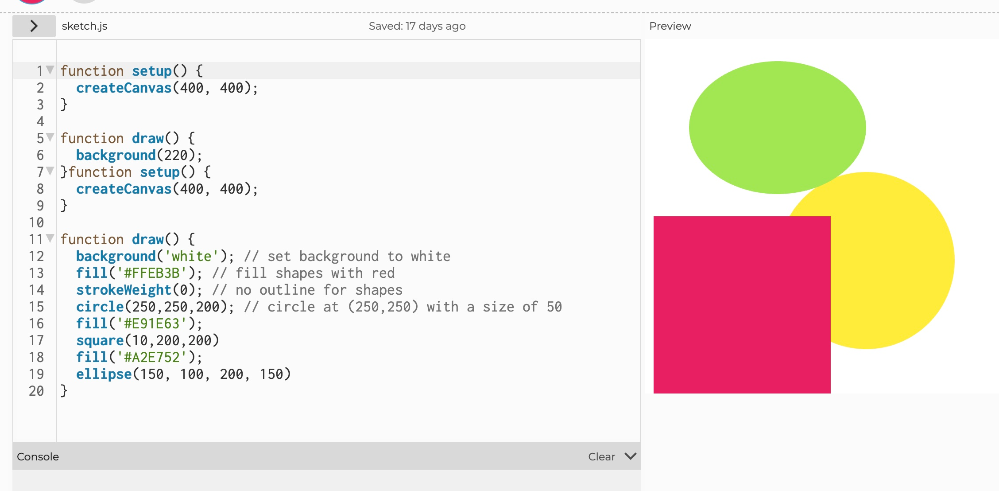
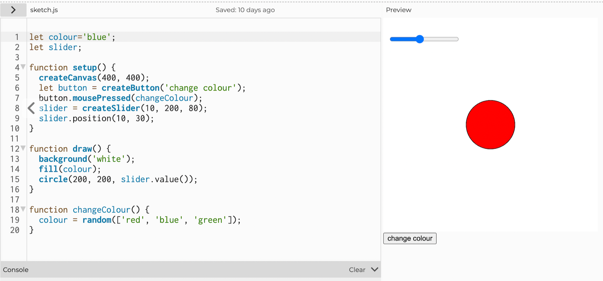
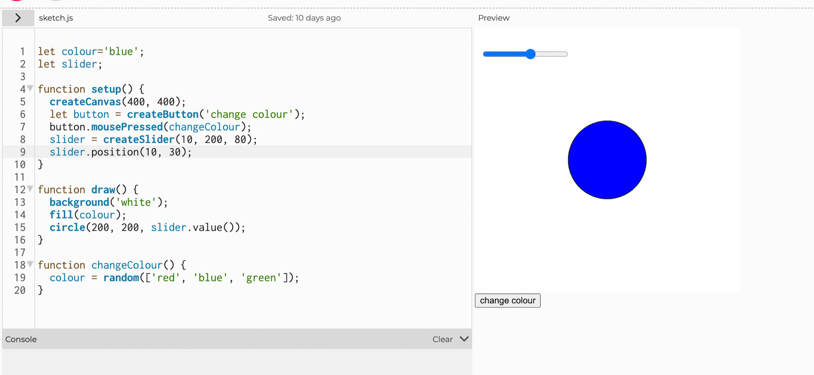
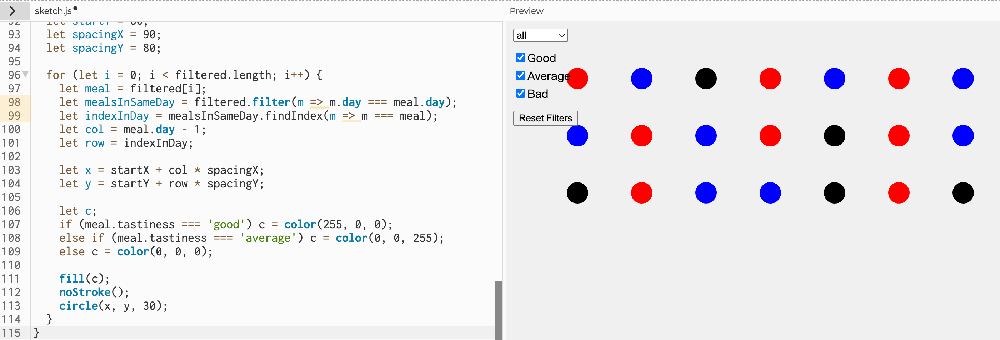
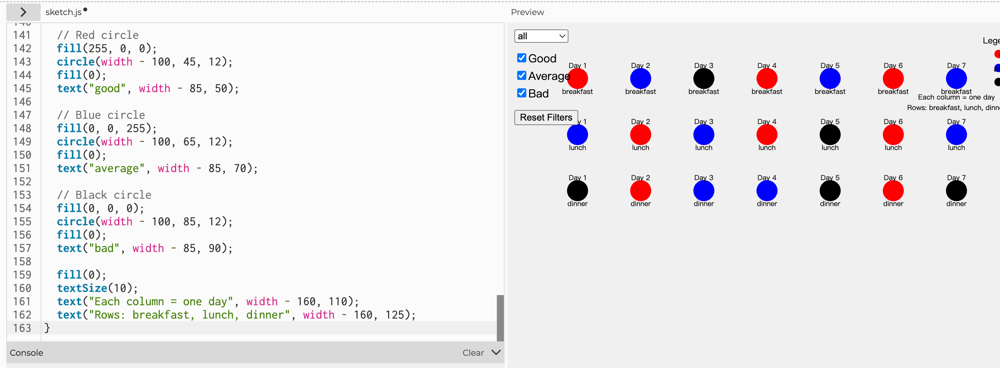
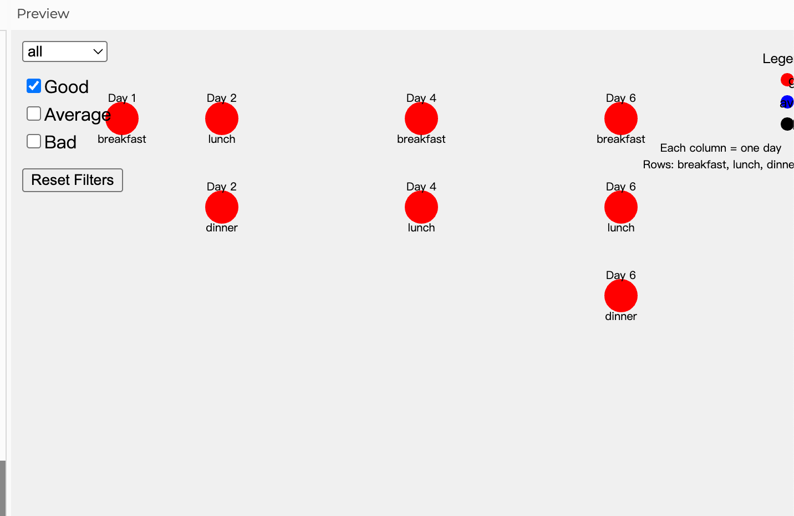

# Week 02

[← Back to Home](../index.md)

## In-Class Activities

### Activity 1: Drawing with Code

I started by getting familiar with the p5.js web editor. I created a simple composition using at least three different shapes, experimenting with colour, size, and position. I also tried changing the order of the drawing instructions to see how it affected the output.

**Main learning:** I followed the content taught by the teacher in class and made different attempts in p5js.

First, there are some more basic attempts: creating patterns of different shapes; Add text; Fill; Reference value; Background. These are relatively basic attempts. Based on these basic attempts, I created a picture composed of three different colors and shapes. 

**Code snippet:**

```javascript
function setup() {
  createCanvas(400, 400);
}

function draw() {
  background(220);
}
```

```javascript
function setup() {
  createCanvas(400, 400);
}

function draw() {
  background('white'); // set background to white
  fill('#FFEB3B'); // fill shapes with yellow
  strokeWeight(0); // no outline for shapes
  circle(250, 250, 200); // circle at (250,250) with diameter 200
  
  fill('#E91E63'); // fill shapes with pink
  square(10, 200, 200);
  
  fill('#A2E752'); // fill shapes with light green
  ellipse(150, 100, 200, 150);
}
```


*Image of drawing with Code*

### Activity 2: Make an Interactive Sketch
We conducted further studies, including variables and DOM elements. Variables include updating variables, built in variables, and conditionals. The DOM elements contain button, slider and text input. Then, on the basis of further study, I created an interactive sketch. 

I created a sketch with at least two interactive DOM elements that control something on the canvas.  I chose a slider to control the size of a shape and a button to randomise its colour.


 **Code snippet:**

```javascript
let colour = 'blue';
let slider;

function setup() {
  createCanvas(400, 400);
  let button = createButton('change colour');
  button.mousePressed(changeColour);
  slider = createSlider(10, 200, 80);
  slider.position(10, 30);
}

function draw() {
  background('white');
  fill(colour);
  circle(200, 200, slider.value());
}

function changeColour() {
  colour = random(['red', 'blue', 'green']);
}
```



*Image of design interactive visualisation created by myself"*


### Activity 3: Vibe Code an Interactive Sketch

I used ChatGPT to help build a more ambitious interactive sketch. I described what I wanted in plain language: a canvas with several bouncing balls that change colour when clicked, and a slider to control the number of balls.

**My prompt to ChatGPT:**

> "Write a p5.js sketch with 5 bouncing balls. Each ball should have a random colour and speed. When a ball is clicked, its colour changes to a new random colour. Add a slider that lets the user adjust the number of balls from 1 to 10, updating the sketch in real time."

**What worked first time:**

- The basic bouncing mechanics worked immediately.
- The click detection using `mouseX`, `mouseY` and distance calculation was accurate.

**What didn't:**

- Updating the number of balls in real time required re-initialising the array. I had to ask a follow-up question to handle that correctly.
- The slider event needed to be handled with a callback function.

**What I learned:**

- Reading the code generated by the LLM helped me understand how arrays of objects work in p5.js.
- Vibe coding is a great way to prototype features beyond my current skill level, but I still need to debug and understand the logic to make it work properly.

**Final sketch code:**

```javascript
let balls = [];
let slider;
let ballCount = 5;

function setup() {
  createCanvas(600, 400);
  slider = createSlider(1, 10, ballCount);
  slider.position(10, height + 10);
  slider.input(updateBallCount);
  initBalls(ballCount);
}

function initBalls(count) {
  balls = [];
  for (let i = 0; i < count; i++) {
    balls.push({
      x: random(width),
      y: random(height),
      vx: random(-2, 2),
      vy: random(-2, 2),
      r: random(15, 30),
      col: color(random(255), random(255), random(255))
    });
  }
}

function updateBallCount() {
  let newCount = slider.value();
  if (newCount > ballCount) {
    for (let i = ballCount; i < newCount; i++) {
      balls.push({
        x: random(width),
        y: random(height),
        vx: random(-2, 2),
        vy: random(-2, 2),
        r: random(15, 30),
        col: color(random(255), random(255), random(255))
      });
    }
  } else if (newCount < ballCount) {
    balls.splice(newCount, ballCount - newCount);
  }
  ballCount = newCount;
}

function draw() {
  background(220);
  for (let ball of balls) {
    ball.x += ball.vx;
    ball.y += ball.vy;
    if (ball.x - ball.r < 0 || ball.x + ball.r > width) ball.vx *= -1;
    if (ball.y - ball.r < 0 || ball.y + ball.r > height) ball.vy *= -1;
    fill(ball.col);
    noStroke();
    circle(ball.x, ball.y, ball.r * 2);
  }
}

function mousePressed() {
  for (let ball of balls) {
    let d = dist(mouseX, mouseY, ball.x, ball.y);
    if (d < ball.r) {
      ball.col = color(random(255), random(255), random(255));
      break;
    }
  }
}
```

*This code creates bouncing balls whose count can be adjusted with a slider, and clicking a ball changes its colour.*

<video src="../assets/week-02/My vedio.mp4" controls width="560"></video>
 
 *Bouncing balls with click interaction and slider control.*

## Independent Study: Interactive Data Portrait

### Step 1: Translate my data drawing into code

For my personal data portrait in Week 1, I tracked the tastiness of the food I ate over **seven days**. Each day I recorded breakfast, lunch, and dinner. I did not write the names of the foods. In my hand‑drawn portrait, I used:

- **Red circle** = good  
- **Blue circle** = average  
- **Black circle** = bad  

All circles were the same size.

I translated this data into a p5.js sketch by creating an array of objects. Each object represents one meal. Below is the data I collected over 7 days (21 meals):

```javascript
let meals = [
  { tastiness: "good", type: "breakfast", day: 1 },
  { tastiness: "average", type: "lunch", day: 1 },
  { tastiness: "bad", type: "dinner", day: 1 },
  { tastiness: "average", type: "breakfast", day: 2 },
  { tastiness: "good", type: "lunch", day: 2 },
  { tastiness: "good", type: "dinner", day: 2 },
  { tastiness: "bad", type: "breakfast", day: 3 },
  { tastiness: "average", type: "lunch", day: 3 },
  { tastiness: "average", type: "dinner", day: 3 },
  { tastiness: "good", type: "breakfast", day: 4 },
  { tastiness: "good", type: "lunch", day: 4 },
  { tastiness: "average", type: "dinner", day: 4 },
  { tastiness: "average", type: "breakfast", day: 5 },
  { tastiness: "bad", type: "lunch", day: 5 },
  { tastiness: "bad", type: "dinner", day: 5 },
  { tastiness: "good", type: "breakfast", day: 6 },
  { tastiness: "good", type: "lunch", day: 6 },
  { tastiness: "good", type: "dinner", day: 6 },
  { tastiness: "average", type: "breakfast", day: 7 },
  { tastiness: "average", type: "lunch", day: 7 },
  { tastiness: "bad", type: "dinner", day: 7 }
];
```

### Step 2: Design interactive visualisation

I wanted viewers to explore patterns across the seven days. I kept the same visual language as my hand‑drawn portrait: all circles are the same size (30px), and colours strictly follow red (good), blue (average), black (bad). I added:

- A **dropdown** to filter by meal type (all / breakfast / lunch / dinner)
- **Checkboxes** to filter by tastiness level (good / average / bad)
- A **button** to reset all filters

Each meal is displayed as a circle. The position is arranged by day: meals from Day 1 are shown first, then Day 2, etc. At this stage, no labels or legend were included.

**Initial p5.js sketch:**

```javascript
let meals = [
  { tastiness: "good", type: "breakfast", day: 1 },
  { tastiness: "average", type: "lunch", day: 1 },
  { tastiness: "bad", type: "dinner", day: 1 },
  { tastiness: "average", type: "breakfast", day: 2 },
  { tastiness: "good", type: "lunch", day: 2 },
  { tastiness: "good", type: "dinner", day: 2 },
  { tastiness: "bad", type: "breakfast", day: 3 },
  { tastiness: "average", type: "lunch", day: 3 },
  { tastiness: "average", type: "dinner", day: 3 },
  { tastiness: "good", type: "breakfast", day: 4 },
  { tastiness: "good", type: "lunch", day: 4 },
  { tastiness: "average", type: "dinner", day: 4 },
  { tastiness: "average", type: "breakfast", day: 5 },
  { tastiness: "bad", type: "lunch", day: 5 },
  { tastiness: "bad", type: "dinner", day: 5 },
  { tastiness: "good", type: "breakfast", day: 6 },
  { tastiness: "good", type: "lunch", day: 6 },
  { tastiness: "good", type: "dinner", day: 6 },
  { tastiness: "average", type: "breakfast", day: 7 },
  { tastiness: "average", type: "lunch", day: 7 },
  { tastiness: "bad", type: "dinner", day: 7 }
];

let selectedType = 'all';
let tasteFilters = {
  good: true,
  average: true,
  bad: true
};

let typeSelect;
let goodCheckbox, avgCheckbox, badCheckbox;
let resetButton;

function setup() {
  createCanvas(800, 600);
  
  typeSelect = createSelect();
  typeSelect.position(10, 10);
  typeSelect.option('all', 'All');
  typeSelect.option('breakfast', 'Breakfast');
  typeSelect.option('lunch', 'Lunch');
  typeSelect.option('dinner', 'Dinner');
  typeSelect.changed(() => { selectedType = typeSelect.value(); });
  
  goodCheckbox = createCheckbox('Good', true);
  goodCheckbox.position(10, 40);
  goodCheckbox.changed(() => { tasteFilters.good = goodCheckbox.checked(); });
  
  avgCheckbox = createCheckbox('Average', true);
  avgCheckbox.position(10, 65);
  avgCheckbox.changed(() => { tasteFilters.average = avgCheckbox.checked(); });
  
  badCheckbox = createCheckbox('Bad', true);
  badCheckbox.position(10, 90);
  badCheckbox.changed(() => { tasteFilters.bad = badCheckbox.checked(); });
  
  resetButton = createButton('Reset Filters');
  resetButton.position(10, 125);
  resetButton.mousePressed(resetFilters);
}

function resetFilters() {
  selectedType = 'all';
  typeSelect.value('all');
  goodCheckbox.checked(true);
  avgCheckbox.checked(true);
  badCheckbox.checked(true);
  tasteFilters.good = true;
  tasteFilters.average = true;
  tasteFilters.bad = true;
}

function draw() {
  background(240);
  
  let filtered = meals.filter(meal => {
    let typeMatch = (selectedType === 'all') || (meal.type === selectedType);
    let tasteMatch = tasteFilters[meal.tastiness];
    return typeMatch && tasteMatch;
  });
  
  let cols = 7;
  let startX = 100;
  let startY = 80;
  let spacingX = 90;
  let spacingY = 80;
  
  for (let i = 0; i < filtered.length; i++) {
    let meal = filtered[i];
    let mealsInSameDay = filtered.filter(m => m.day === meal.day);
    let indexInDay = mealsInSameDay.findIndex(m => m === meal);
    let col = meal.day - 1;
    let row = indexInDay;
    
    let x = startX + col * spacingX;
    let y = startY + row * spacingY;
    
    let c;
    if (meal.tastiness === 'good') c = color(255, 0, 0);
    else if (meal.tastiness === 'average') c = color(0, 0, 255);
    else c = color(0, 0, 0);
    
    fill(c);
    noStroke();
    circle(x, y, 30);
  }
}
```

*This picture is a basic design, featuring only fundamental interactions and no specific elements.*

### Step 3: Iterate

After testing the initial sketch with a classmate, I received two important suggestions:

1. **Add a legend** – the colour coding (red = good, blue = average, black = bad) was not immediately obvious.  
2. **Label the days and meal types** – without labels, it was hard to know which circle corresponded to which day or meal.

I incorporated both suggestions by adding a legend in the top‑right corner and displaying “Day X” above each circle and the meal type below it. I also added explanatory text in the legend to clarify the layout (columns = days, rows = breakfast/lunch/dinner).

The final sketch now allows viewers to filter by meal type (breakfast, lunch, dinner) and tastiness (good, average, bad) while preserving the chronological structure of the original hand‑drawn portrait. All circles remain the same size, and colours strictly follow the original mapping.

**Final p5.js sketch (ready to paste into the p5.js editor):**

```javascript
let meals = [
  { tastiness: "good", type: "breakfast", day: 1 },
  { tastiness: "average", type: "lunch", day: 1 },
  { tastiness: "bad", type: "dinner", day: 1 },
  { tastiness: "average", type: "breakfast", day: 2 },
  { tastiness: "good", type: "lunch", day: 2 },
  { tastiness: "good", type: "dinner", day: 2 },
  { tastiness: "bad", type: "breakfast", day: 3 },
  { tastiness: "average", type: "lunch", day: 3 },
  { tastiness: "average", type: "dinner", day: 3 },
  { tastiness: "good", type: "breakfast", day: 4 },
  { tastiness: "good", type: "lunch", day: 4 },
  { tastiness: "average", type: "dinner", day: 4 },
  { tastiness: "average", type: "breakfast", day: 5 },
  { tastiness: "bad", type: "lunch", day: 5 },
  { tastiness: "bad", type: "dinner", day: 5 },
  { tastiness: "good", type: "breakfast", day: 6 },
  { tastiness: "good", type: "lunch", day: 6 },
  { tastiness: "good", type: "dinner", day: 6 },
  { tastiness: "average", type: "breakfast", day: 7 },
  { tastiness: "average", type: "lunch", day: 7 },
  { tastiness: "bad", type: "dinner", day: 7 }
];

let selectedType = 'all';
let tasteFilters = {
  good: true,
  average: true,
  bad: true
};

let typeSelect;
let goodCheckbox, avgCheckbox, badCheckbox;
let resetButton;

function setup() {
  createCanvas(800, 600);
  
  typeSelect = createSelect();
  typeSelect.position(10, 10);
  typeSelect.option('all', 'All');
  typeSelect.option('breakfast', 'Breakfast');
  typeSelect.option('lunch', 'Lunch');
  typeSelect.option('dinner', 'Dinner');
  typeSelect.changed(() => { selectedType = typeSelect.value(); });
  
  goodCheckbox = createCheckbox('Good', true);
  goodCheckbox.position(10, 40);
  goodCheckbox.changed(() => { tasteFilters.good = goodCheckbox.checked(); });
  
  avgCheckbox = createCheckbox('Average', true);
  avgCheckbox.position(10, 65);
  avgCheckbox.changed(() => { tasteFilters.average = avgCheckbox.checked(); });
  
  badCheckbox = createCheckbox('Bad', true);
  badCheckbox.position(10, 90);
  badCheckbox.changed(() => { tasteFilters.bad = badCheckbox.checked(); });
  
  resetButton = createButton('Reset Filters');
  resetButton.position(10, 125);
  resetButton.mousePressed(resetFilters);
}

function resetFilters() {
  selectedType = 'all';
  typeSelect.value('all');
  goodCheckbox.checked(true);
  avgCheckbox.checked(true);
  badCheckbox.checked(true);
  tasteFilters.good = true;
  tasteFilters.average = true;
  tasteFilters.bad = true;
}

function draw() {
  background(240);
  
  let filtered = meals.filter(meal => {
    let typeMatch = (selectedType === 'all') || (meal.type === selectedType);
    let tasteMatch = tasteFilters[meal.tastiness];
    return typeMatch && tasteMatch;
  });
  
  let cols = 7;
  let startX = 100;
  let startY = 80;
  let spacingX = 90;
  let spacingY = 80;
  
  for (let i = 0; i < filtered.length; i++) {
    let meal = filtered[i];
    let mealsInSameDay = filtered.filter(m => m.day === meal.day);
    let indexInDay = mealsInSameDay.findIndex(m => m === meal);
    let col = meal.day - 1;
    let row = indexInDay;
    
    let x = startX + col * spacingX;
    let y = startY + row * spacingY;
    
    let c;
    if (meal.tastiness === 'good') c = color(255, 0, 0);
    else if (meal.tastiness === 'average') c = color(0, 0, 255);
    else c = color(0, 0, 0);
    
    fill(c);
    noStroke();
    circle(x, y, 30);
    
    fill(0);
    textAlign(CENTER);
    textSize(10);
    text("Day " + meal.day, x, y - 15);
    text(meal.type, x, y + 22);
  }
  
  drawLegend();
}

function drawLegend() {
  fill(0);
  textSize(12);
  text("Legend:", width - 100, 30);
  
  fill(255, 0, 0);
  circle(width - 100, 45, 12);
  fill(0);
  text("good", width - 85, 50);
  
  fill(0, 0, 255);
  circle(width - 100, 65, 12);
  fill(0);
  text("average", width - 85, 70);
  
  fill(0, 0, 0);
  circle(width - 100, 85, 12);
  fill(0);
  text("bad", width - 85, 90);
  
  fill(0);
  textSize(10);
  text("Each column = one day", width - 160, 110);
  text("Rows: breakfast, lunch, dinner", width - 160, 125);
}
```



*This diagram is the final version after iteration based on feedback*

## AI Usage Statement

During the completion of **Experiment 2: Interactivity**, I used generative AI tools to assist with coding, debugging, and documentation.

**Tools Used**

- **ChatGPT (OpenAI)**: I used ChatGPT to generate the initial p5.js code for the bouncing balls sketch (Activity 3) and to help implement the checkbox filters and reset button for my interactive data portrait. I provided plain‑language descriptions of the desired functionality, then tested, debugged, and adapted the generated code to fit my specific data and visual design. I also used it to refine the structure of my reflection and ensure technical accuracy in my documentation.

- **Gemini (Google)**: I used Gemini to ask for examples of how to use `createSelect()` and `createCheckbox()` in p5.js, and to clarify the syntax for handling multiple filter states. I referenced the explanations to write my own implementation.

**AI‑Generated Content Referenced**

- **ChatGPT (OpenAI).** (2026, March 30). Conversation regarding p5.js bouncing balls sketch with interactive controls. Conversation ID: chat-2026-03-30-week02-bouncing.

- **ChatGPT (OpenAI).** (2026, March 30). Conversation regarding p5.js checkbox filters and reset button for data portrait sketch. Conversation ID: chat-2026-03-30-week02-filters.

- **Google Gemini.** (2026, March 30). Conversation regarding p5.js createSelect and createCheckbox functions. Conversation ID: gemini-2026-03-30-week02-p5js.

**Usage Notes**

- AI tools were used for **code generation, debugging assistance, function explanations, and structural guidance for documentation**.
- The following work was completed independently:
  - Selection of data to visualise (7 days, 21 meals)
  - Visual mapping decisions (red = good, blue = average, black = bad; all circles same size)
  - Overall sketch design, layout (days as columns, meals as rows), and interaction decisions
  - Adaptation, testing, and refinement of all AI‑generated code
  - Final reflections, analysis, and critical engagement with course concepts
- This statement follows the course’s transparency requirements for AI use under Lane 2 (uncontrolled assessments).

**References**

OpenAI. (2026). *ChatGPT* (Mar 30 version) [Large language model]. https://chat.openai.com

Google. (2026). *Gemini* (Mar 30 version) [Large language model]. https://gemini.google.com

