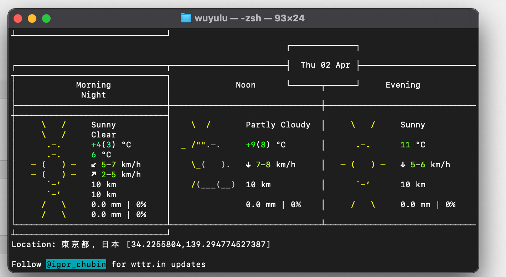
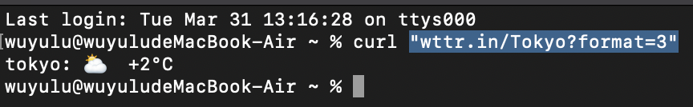
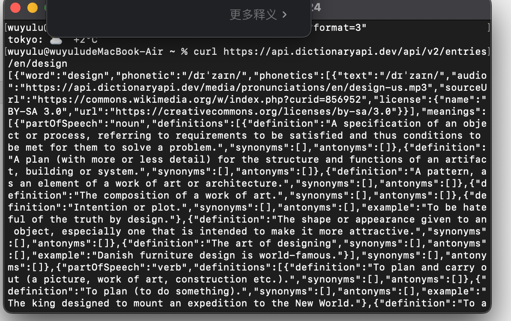
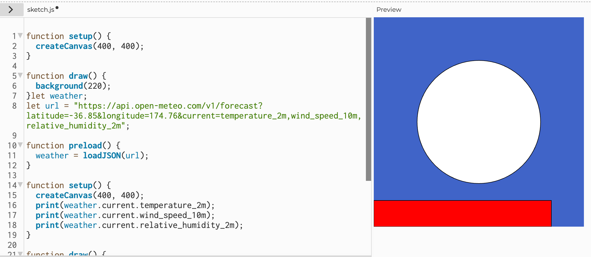
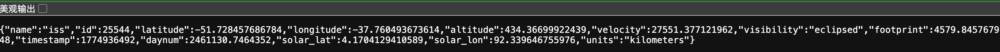
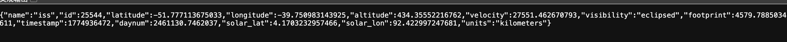
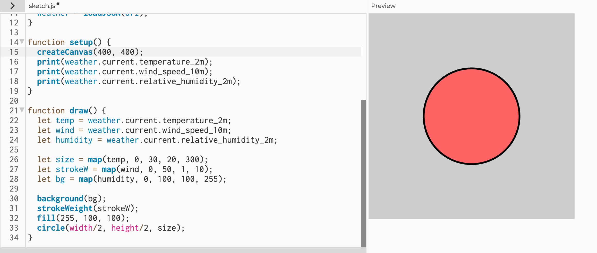
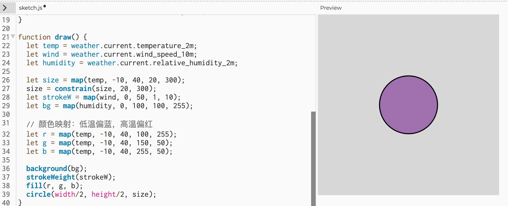
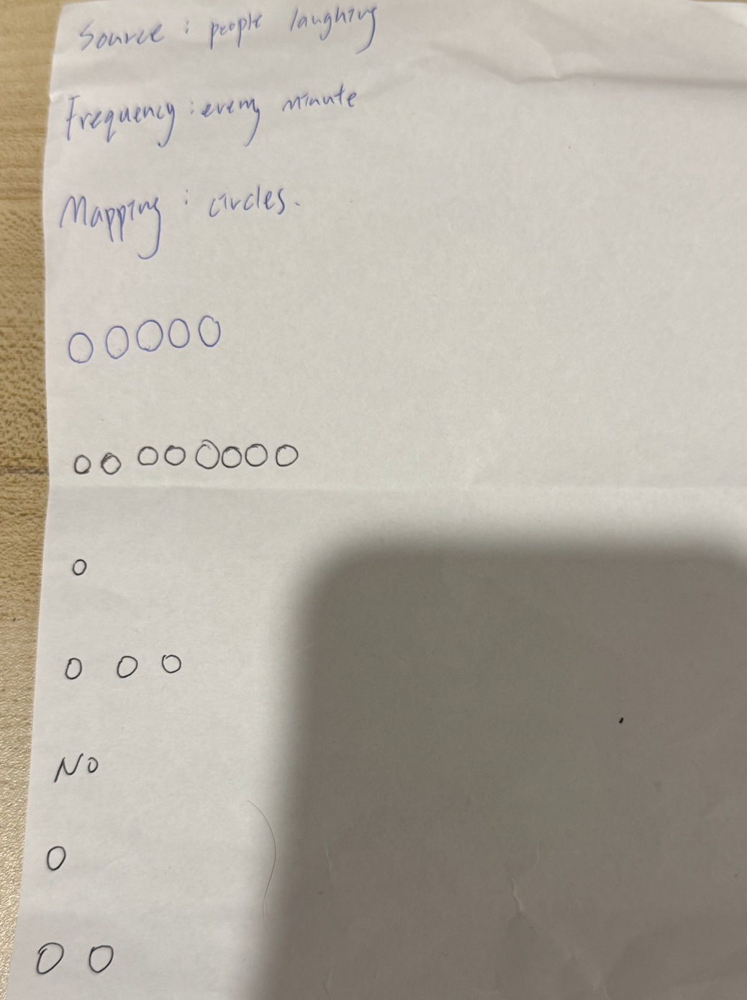
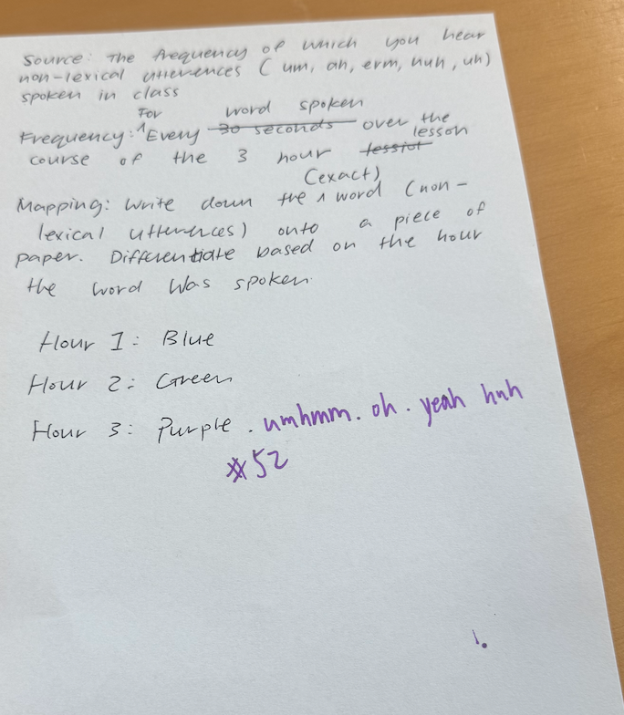

# Week 03

[← Back to Home](../index.md)

## Experiment 3: Live Data
### In-Class Activities
#### Activity 1: Explore with cURL
Clicking command and space and searching can directly bring up terminal, allowing you to use the terminal directly.I opened my terminal and experimented with the wttr.in API  understand how to request and filter live data from the command line.

**Here are some of my attempts**

**Weather ：** curl wttr.in/Tokyo


**Filtering live data:**"wttr.in/Tokyo?format=3"


**Raw data:** curl https://api.dictionaryapi.dev/api/v2/entries/en/design


**Drawing with weather:** I opened the demo weather sketch in the p5.js web editor and experimented with mapping live weather data to visual properties.


*The diagram I made using the code given in class*

**Live Updates：**
I also tried to check some real-time updated data, and some of the data flows very quickly.



*In class, I attempted to observe the changes in the longitude and latitude of the space station*

**What I learned:** p5.js has some built-in functions that can generate changing values in each frame. These data are real-time data when conducting prototype design.

#### Activity 2: Weather Visualisation
I opened the demo weather sketch in the p5.js web editor and experimented with mapping live weather data to visual properties.

**code snippet:**

```javascript
let weather;
let url = "https://api.open-meteo.com/v1/forecast?latitude=-36.85&longitude=174.76&current=temperature_2m,wind_speed_10m,relative_humidity_2m";

function preload() {
  weather = loadJSON(url);
}

function setup() {
  createCanvas(400, 400);
  print(weather.current.temperature_2m);
  print(weather.current.wind_speed_10m);
  print(weather.current.relative_humidity_2m);
}

function draw() {
  let temp = weather.current.temperature_2m;
  let wind = weather.current.wind_speed_10m;
  let humidity = weather.current.relative_humidity_2m;
  
  let size = map(temp, 0, 30, 20, 300);
  let strokeW = map(wind, 0, 50, 1, 10);
  let bg = map(humidity, 0, 100, 100, 255);
  
  background(bg);
  strokeWeight(strokeW);
  fill(255, 100, 100);
  circle(width/2, height/2, size);
}
```

Initial sketch (Auckland):


**Changed location to London**

I modified the weather visualisation by changing the latitude and longitude to London (51.5074, -0.1278). The circle became smaller and the background darker, reflecting the cooler temperatures and higher humidity typical of London compared to Auckland.

**Updated code:**

```javascript
let weather;
let url = "https://api.open-meteo.com/v1/forecast?latitude=51.5074&longitude=-0.1278&current=temperature_2m,wind_speed_10m,relative_humidity_2m";

function preload() {
  weather = loadJSON(url);
}

function setup() {
  createCanvas(400, 400);
  print(weather.current.temperature_2m);
  print(weather.current.wind_speed_10m);
  print(weather.current.relative_humidity_2m);
}

function draw() {
  let temp = weather.current.temperature_2m;
  let wind = weather.current.wind_speed_10m;
  let humidity = weather.current.relative_humidity_2m;
  
  let size = map(temp, 0, 30, 20, 300);
  let strokeW = map(wind, 0, 50, 1, 10);
  let bg = map(humidity, 0, 100, 100, 255);
  
  background(bg);
  strokeWeight(strokeW);
  fill(255, 100, 100);
  circle(width/2, height/2, size);
}
```



**What I learned from Activity 2:**

- Using `print()` in the console was essential to understand the range of temperature values (Auckland: ~20°C, London: ~12°C) before mapping them.
- Adding extra API parameters (like `wind_direction_10m`) requires updating both the URL and the mapping logic.
- Combining `noise()` with live data created a more organic, less mechanical feel.
- **Important correction:** I initially hard-coded the circle colour as red, which did not reflect the data. By mapping colour to temperature, the visualisation became truly data-driven: cold places appear blueish, warm places reddish.
- The mapping function `map(value, start1, stop1, start2, stop2)` is powerful but must be used with realistic ranges. For temperature, I set -10°C to 40°C to cover most weather conditions.

#### Activity 3: Design and Execute a Data Protocol

**My partner and I designed the following protocol:**

> **Protocol: Laughter Tracker**
>
> **Source:** people laughing
>
> **Frequency:** Every minute 
>
> **Mapping:**
>  For each laugh detected, draw one **small circle** on paper.
>
> **Duration:**
 Run the protocol for 7 minutes.

**Data collected (from my group’s observation):**

| Minute | Number of laughs | Circles drawn |
|--------|------------------|---------------|
| 1      | 5                | ○ ○ ○ ○ ○            |
| 2      | 8                |  ○ ○ ○ ○ ○ ○ ○ ○     |
| 3      | 1                | ○             |
| 4      | 3                | ○ ○ ○         |
| 5      | 0                | (blank)       |
| 6      | 1                | ○             |
| 7      | 2                | ○ ○           |

**Our executed drawing:**


*Each circle represents one laugh.*

**Swap with another pair:**

We exchanged protocols with another group.Their protocol tracked **the freuquency of which you hear non-lexical utterances spoken in class**,write down the exact word on paper.They said the frequency is every hour of the course,but because of the limited time,we followed their instructions for 10 minutes.




**What we learned:**

- Our protocol was very specific (“laugh out loud”) and produced clean, easy‑to‑interpret data.
- The other group’s protocol had edge cases (e.g., checking a smartwatch) that we had to interpret ourselves.
- The act of drawing circles every minute made the passage of time feel tangible. Minutes with no laughter felt “empty” on paper.
- Swapping protocols revealed how small ambiguities in instructions can lead to different results, even when the same rule is followed literally.
**Comparison of outcomes:**

| Aspect | Our protocol (laughter) | Their protocol (non‑lexical utterances) |
|--------|-------------------------|------------------------------------------|
| Ease of following | Easy – clear sound cue | Moderate – some utterances were quiet or ambiguous |
| Frequency | Every minute |  once per hour  |
| Mapping | One circle = one laugh | Write the exact word each time |
| Data density | Sometimes dense and sometimes sparse | Higher density (up to 3–4 utterances per minute) |
| Visual/textual result | Pattern of  clusters of circles |  revealing common speech habits |

**What surprised us:**

- Their protocol is designed for a much slower frequency (per hour), but I think it is based on the topic they have chosen.
- The act of writing down exact words makes us pay more attention to the subtle differences between individual words.
- Our laughter solution has produced a more abstract, pattern-based visualization, while theirs has generated a concrete list of words that feels more like a written record.

**What we learned about protocol design:**

- **Frequency issue：** Whether it is hourly recording or minute-by-minute recording, it is based on what one chooses to record 
- **Choice shaping result：** Circles (abstract) and written text (text) lead to completely different types of data recording. Neither is better, but they both reveal different things.
- **Ambiguity is inevitable:** Even with clear instructions, we must decide whether a very gentle "uh" counts or whether "er" and "uh" are different. This reflects the challenges faced by data collection in the real world.

**Connection to course themes:**

This activity connects to what we learned in class in a few simple ways:

- **1.Data is not just numbers.** Recording laughter as circles, and writing down words like "um" or "uh", shows that data can be visual and personal.Small, human details are important

- **2.The process is the product.** In Conditional Design, the rules you follow are as important as the final drawing. Our protocol and the other group's protocol  both produced interesting results .

- **3.Live data changes over time.** Like the weather API or the ISS tracker in class, our laughter data was different every minute.     Some minutes had many laughs, some had none.     This shows that live data has a rhythm.

- **4.Making rules is hard.** When we swapped protocols, we noticed small problems: is a quiet "uh" still an "uh"?      This is just like working with real APIs – you have to decide exactly what data to collect and how to record it.

Overall, this exercise taught me that collecting data by hand (analogue) can be just as powerful as using a computer.     It makes you pay more attention to the world around you.

### Independent Study: Live Data Visualisation

I chose a **digital approach** for this experiment, building on the p5.js skills I developed in Week 2.

#### Live Data Source

I used the **Open-Meteo Air Quality API**. It is free, requires no API key, and returns hourly PM2.5 and PM10 data. I wanted to see how air pollution changes over the course of a day.


#### Mapping Data to Visual Form

| Data | Visual Element | Mapping |
|------|----------------|---------|
| PM2.5 concentration | Circle size | Higher value = larger circle |
| PM10 concentration | Background colour | Higher value = darker background (deep red) |
| Time (hour) | Slider position | Drag the slider to view different hours |

All mappings use the `map()` function, with `constrain()` to keep graphics within the canvas.

#### Final p5.js Sketch

```javascript
let airData;
let hourSlider;
let currentHour = 0;
let pm25Values = [];
let pm10Values = [];
let hours = [];

function preload() {
  let url = "https://air-quality-api.open-meteo.com/v1/air-quality?latitude=-36.85&longitude=174.76&hourly=pm10,pm2_5&timezone=auto";
  airData = loadJSON(url);
}

function setup() {
  createCanvas(800, 500);
  
  // Extract data from JSON
  let hourly = airData.hourly;
  pm25Values = hourly.pm2_5;
  pm10Values = hourly.pm10;
  hours = hourly.time.map(t => new Date(t).getHours());
  
  // Create slider
  hourSlider = createSlider(0, hours.length - 1, 0);
  hourSlider.position(10, height - 30);
  hourSlider.input(() => { currentHour = hourSlider.value(); });
}

function draw() {
  let pm25 = pm25Values[currentHour];
  let pm10 = pm10Values[currentHour];
  let hour = hours[currentHour];
  
  // Map size
  let size = map(pm25, 0, 100, 20, 300);
  size = constrain(size, 20, 300);
  
  // Map background colour (higher PM10 = darker background)
  let bgColor = map(pm10, 0, 100, 200, 50);
  background(bgColor);
  
  // Draw circle
  fill(255, 100, 100, 180);
  noStroke();
  circle(width/2, height/2, size);
  
  // Display text
  fill(0);
  textAlign(CENTER);
  textSize(16);
  text("Hour: " + hour + ":00", width/2, height - 60);
  text("PM2.5: " + pm25 + " µg/m³", width/2, height - 40);
  text("PM10: " + pm10 + " µg/m³", width/2, height - 20);
  
  // Draw small timeline preview
  drawTimeline();
}

function drawTimeline() {
  let w = width - 40;
  let h = 60;
  let startX = 20;
  let startY = height - 100;
  
  fill(200);
  rect(startX, startY, w, h);
  
  for (let i = 0; i < pm25Values.length; i++) {
    let x = startX + (i / pm25Values.length) * w;
    let barHeight = map(pm25Values[i], 0, 100, 0, h);
    fill(255, 100, 100);
    rect(x, startY + h - barHeight, w / pm25Values.length, barHeight);
  }
  
  // Mark current hour position
  let markerX = startX + (currentHour / pm25Values.length) * w;
  stroke(0);
  strokeWeight(2);
  line(markerX, startY, markerX, startY + h);
  strokeWeight(1);
}
```
<video src="../assets/week-03/vedio1.mp4" controls width="560"></video>

*Above: PM2.5 circle size and background colour change with each hour. The slider lets you browse different times.*

#### Reflection
**Why the digital approach?**

I wanted to continue practising p5.js and API calls. Also, a digital approach updates in real time without manual recording.

**What does this visualisation reveal?**

The timeline shows that PM2.5 rises during morning rush hour (8‑9am) and evening rush hour (5‑6pm), probably due to car exhaust. Numbers alone would not make this pattern so clear.

**Mapping choices**

A larger circle means worse pollution, and a darker background also means worse pollution. Both work together to let viewers instantly judge air quality.

**Connection to class examples**

Like David Bowen’s Tele‑Present Wind, I turned remote data (air quality) into something visible.

Like Conditional Design, I set up rules (size = PM2.5, background = PM10) and let the rules generate the result.

**What would I improve with more time?**

Add animation so the circle changes automatically over time, without needing to drag the slider.

Include a 7‑day forecast.

Make a mobile-friendly version.

## AI Usage Statement

*Document any use of AI tools under an AI Usage Statement heading. Explain which tools you used and describe how you used them. Reference any AI-generated content (see [QuickCite](https://auckland.libguides.com/referencing-generative-ai-tools) for guidance).*

During the completion of **Experiment 3: Live Data**, I used generative AI tools to assist with coding, API integration, and documentation.

**Tools Used**

- **ChatGPT (OpenAI)**: I used ChatGPT to generate the initial p5.js code for the air quality visualisation, including the timeline preview and slider interaction. I described the functionality I wanted (hourly data, slider, timeline) and adapted the generated code to fit my specific data and visual design. I also used it to help debug the `map()` and `constrain()` functions and to structure my reflection.

- **Gemini (Google)**: I used Gemini to understand the structure of the Open-Meteo Air Quality API response, particularly how to extract the hourly arrays (`pm2_5`, `pm10`, `time`) from the JSON object. I also asked for examples of how to convert time strings to readable hour formats.

**AI‑Generated Content Referenced**

- **ChatGPT (OpenAI).** (2026, March 30). Conversation regarding p5.js air quality visualisation with timeline and slider. Conversation ID: chat-2026-03-30-week03-airquality.

- **Google Gemini.** (2026, March 30). Conversation regarding Open-Meteo API JSON structure and hour extraction. Conversation ID: gemini-2026-03-30-week03-api.

**Usage Notes**

- AI tools were used for **code generation, debugging assistance, API documentation interpretation, and structural guidance for documentation**.
- The following work was completed independently:
  - Selection of air quality as the data theme
  - Visual mapping decisions (size = PM2.5, background = PM10)
  - Overall sketch design and interaction decisions
  - Adaptation, testing, and refinement of all AI‑generated code
  - Final reflections and analysis
- This statement follows the course’s transparency requirements for AI use under Lane 2 (uncontrolled assessments).

**References**

OpenAI. (2026). *ChatGPT* (Mar 30 version) [Large language model]. https://chat.openai.com

Google. (2026). *Gemini* (Mar 30 version) [Large language model]. https://gemini.google.com
