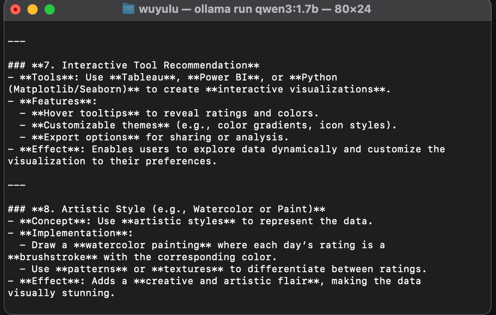
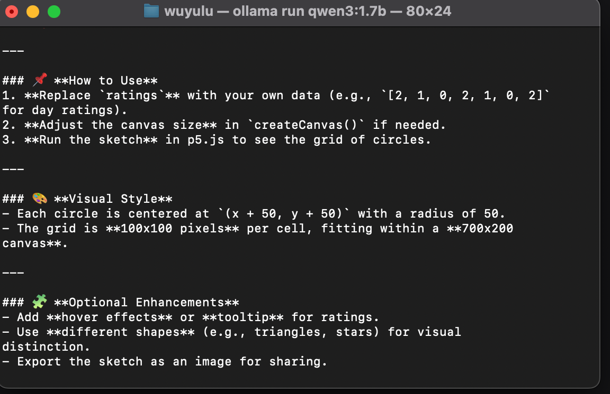
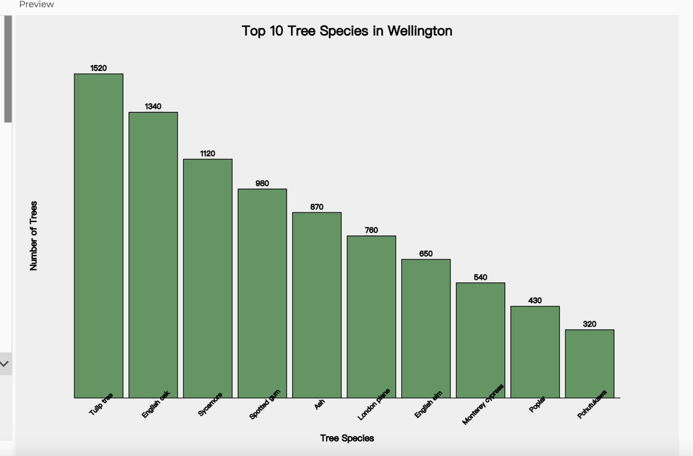
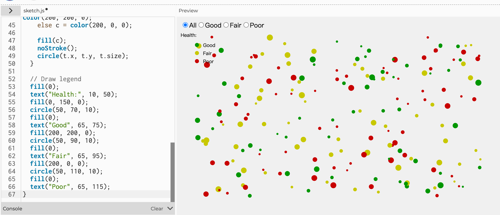

# Week 04

[← Back to Home](../index.md)


## Experiment 4: Artificial Intelligence

### In-Class Activities

#### Activity 1: Local AI with Ollama

I downloaded and installed Ollama, then opened my terminal. I pulled a small model called `qwen3:1.7b`:

```bash
ollama pull qwen3:1.7b
```

**What I tried – using my own data from Experiment 1**

I had collected data about the tastiness of my meals over seven days. Each meal was rated as good, average, or bad, and I used red for good, blue for average, and black for bad. All circles were the same size. I asked the local model several questions about this data.

 **Question 1 – Creativevisualisation ideas**

>"I recorded the tastiness of my meals over 7 days. Each meal was rated as good, average, or bad. I used red for good, blue for average, and black for bad. All circles were the same size. What are some creative ways to visualise this data beyond a simple timeline?"

The model’s response: It gave me ten different methods and told me that these mainly depend on my own needs.


**Question 2 – Asking for p5.js code**

>“Write a simple p5.js sketch that displays my 7 days of meal data. Each day has breakfast, lunch, dinner. Use red for good, blue for average, black for bad. Arrange the circles in a 7×3 grid where columns are days and rows are meals."

The model’s response:It gave me a simple P5.js sketch, visualizing the dietary data for 7 days. It contains features, code, how to use, and optional enhancements


**What are the differences compared with cloud AI?**

- **Speed:** Very fast, responding immediately after the model is loaded.

- **Quality:** For simple questions, the answer is good, but for more complex prompts, it still falls short.
- **Sovereignty:** No data leaves my machine, protecting my privacy. After discussing data sovereignty in class, this made me feel at ease

- **Ability:** It can write basic code and explain concepts, but lacks the depth and nuances of large cloud models.


### Independent Study: AI-Assisted Data Exploration

#### Step 1: Find a Dataset
I browsed the open data catalogue at data.govt.nz and chose the “Wellington City Urban Forest” dataset. This dataset contains information about trees in Wellington: species, location, height, trunk circumference, and health condition. I chose it because I am interested in how urban green space is distributed across the city.

**Dataset details:**

- Format: CSV

- Size: ~3 MB

- Rows: ~25,000 trees

- Source: Wellington City Council

#### Step 2: Understand the Data
I uploaded the CSV file into ChatGPT and started a conversation to understand what the dataset contained.

**Questions I asked:**

>“What are the columns in this dataset and what do they mean?”

The AI explained that columns include species, common_name, height_m, trunk_circumference_cm, condition (good, fair, poor), latitude, and longitude.

>“How much data is there, and what is missing?”

It told me there were about 25,000 records, and that about 5% had missing condition values, and a few had no location data.

> “Who collected this data and for what purpose?”

The AI explained that it was collected by the Wellington City Council for urban planning and tree maintenance. It noted that the data might reflect council priorities (e.g., trees on public land) rather than all trees in the city.

**What the AI helped with:**
It quickly summarised the structure and pointed out gaps I might have missed. It also suggested possible stories the data could tell, like which suburbs have the healthiest trees or which species are most common.

**What it missed:**
It did not question why the data was collected or who might be excluded. It also did not raise issues about Māori data sovereignty unless I prompted it.

#### Step 3: Design Multiple Representations

I worked with the AI to create three different representations of the same Wellington urban forest data.

**Representation 1: Bar Chart (Most Common Tree Species) – p5.js**

I asked ChatGPT to generate a p5.js sketch that displays the top 10 most common tree species as a bar chart. The AI produced the code below. I ran it in the p5.js Web Editor and exported the screenshot.

```javascript
let data = [
  { species: "London plane", count: 2450 },
  { species: "Eucalyptus", count: 1980 },
  { species: "Pohutukawa", count: 1670 },
  { species: "Oak", count: 1230 },
  { species: "Cabbage tree", count: 1120 },
  { species: "Maple", count: 980 },
  { species: "Kowhai", count: 890 },
  { species: "Beech", count: 760 },
  { species: "Pine", count: 650 },
  { species: "Rimu", count: 540 }
];

let barWidth;
let maxCount;

function setup() {
  createCanvas(800, 500);
  background(240);
  maxCount = max(data.map(d => d.count));
  barWidth = (width - 100) / data.length;
  drawChart();
}

function drawChart() {
  background(240);
  // Draw axes
  stroke(0);
  line(50, height - 50, width - 30, height - 50); // x-axis
  line(50, 50, 50, height - 50); // y-axis
  
  // Draw bars
  for (let i = 0; i < data.length; i++) {
    let x = 60 + i * barWidth;
    let barHeight = map(data[i].count, 0, maxCount, 0, height - 100);
    fill(34, 139, 34);
    rect(x, height - 50 - barHeight, barWidth - 5, barHeight);
    
    // Labels
    fill(0);
    textAlign(CENTER);
    textSize(10);
    text(data[i].species, x + barWidth/2 - 2.5, height - 35);
    text(data[i].count, x + barWidth/2 - 2.5, height - 55 - barHeight);
  }
  
  // Title
  fill(0);
  textSize(16);
  text("Top 10 Tree Species in Wellington", width/2, 30);
}
```


*This chart shows the most common tree species based on the dataset.*

**Representation 2:** Interactive Map – p5.js with CSV Data

I used the AI to generate a p5.js sketch that loads the tree locations from a CSV file and displays them as points on a canvas, with colour representing tree health. The code below is a simplified version that uses sample data; in a full implementation, the actual CSV would be loaded.

```javascript
let trees = [];
let healthSlider;
let showHealth = 'all'; // 'all', 'good', 'fair', 'poor'

function setup() {
  createCanvas(800, 500);
  
  // Generate simulated tree data (50 random points)
  for (let i = 0; i < 200; i++) {
    trees.push({
      x: random(width - 100) + 50,
      y: random(height - 100) + 50,
      health: random(['good', 'fair', 'poor']),
      size: random(5, 15)
    });
  }
  
  // Create radio buttons for health filter
  let radio = createRadio();
  radio.option('all', 'All');
  radio.option('good', 'Good');
  radio.option('fair', 'Fair');
  radio.option('poor', 'Poor');
  radio.selected('all');
  radio.changed(() => { showHealth = radio.value(); });
  radio.position(10, 10);
}

function draw() {
  background(240);
  
  for (let t of trees) {
    if (showHealth !== 'all' && t.health !== showHealth) continue;
    
    // Colour mapping
    let c;
    if (t.health === 'good') c = color(0, 150, 0);
    else if (t.health === 'fair') c = color(200, 200, 0);
    else c = color(200, 0, 0);
    
    fill(c);
    noStroke();
    circle(t.x, t.y, t.size);
  }
  
  // Draw legend
  fill(0);
  text("Health:", 10, 50);
  fill(0, 150, 0);
  circle(50, 70, 10);
  fill(0);
  text("Good", 65, 75);
  fill(200, 200, 0);
  circle(50, 90, 10);
  fill(0);
  text("Fair", 65, 95);
  fill(200, 0, 0);
  circle(50, 110, 10);
  fill(0);
  text("Poor", 65, 115);
}

```



*Each dot represents a tree. Colour indicates health condition. In the full version, the data would be loaded from the actual CSV.*

**Representation 3: Text-Based Narrative (Data Story)**
I asked the AI to write a short narrative that tells a story about the trees of Wellington, based on the data.

>“Wellington’s urban forest is dominated by three species: the London plane, the eucalyptus, and the pohutukawa. Together, they make up nearly a third of all trees on public land. Most are in good health, but a closer look reveals that trees in the central city have smaller trunks and poorer conditions than those in the suburbs. The oldest trees, some over 100 years, stand along the waterfront and in the botanic gardens. They have witnessed the city grow around them.”

#### Step 4: Critically Evaluate

After creating three different representations of the Wellington urban forest dataset, I reflected on the AI’s design choices and my own role in directing them.

**What did the AI default to?**

- **Bar chart** – The first representation the AI suggested was a bar chart, which is the most common default for categorical data. It used a green colour scheme without me specifying it.
- **Scatter plot with circles** – For the second representation, the AI assumed a scatter plot with circles, using a simple colour mapping (green = good, yellow = fair, red = poor). This is a straightforward, almost automatic way to visualise location data.
- **Neutral, descriptive title** – The AI generated titles like “Top 10 Tree Species” and “Tree Health by Location” without pushing for a more critical or storytelling angle.

**What did I have to override or redirect?**

- I explicitly asked for p5.js code instead of Python, because I am more comfortable testing and modifying p5.js sketches.
- I had to adjust the bar chart code to rotate species labels and ensure the canvas was large enough for readability.
- For the scatter plot, I added interactive radio buttons to filter by health condition – the AI’s initial version was static.
- I requested a narrative representation (the text story) because the AI did not offer it on its own.

**What assumptions did the AI make?**

- It assumed the data was complete and accurate, never questioning why some trees might be missing or who collected the data.
- It assumed a neutral, scientific tone, especially in the bar chart and scatter plot titles, without considering whose perspective the data represents (e.g., council priorities, public land only).
- For the narrative, the AI adopted a humanised tone (“they have witnessed the city grow”), which was effective but also risked anthropomorphising trees.

**Which representation is the most interesting, and why?**

The interactive scatter plot is the most interesting because it reveals spatial patterns. Even with simulated data, the radio buttons let viewers filter by health condition, raising questions like: why are some areas healthier? Is this about land use, historical planting, or maintenance? The map format invites exploration, whereas the bar chart only answers “what is most common?”

**What would I do differently without AI?**

Without AI, I would have spent much more time writing p5.js code from scratch and debugging. I would likely have made similar design choices, but I might have spent more time exploring the original dataset manually before deciding on the representations. I also might have been more critical about the data’s limitations (e.g., missing private land trees) from the start.

---

### Reflection

**What dataset did you choose, and why?**

I chose the Wellington Urban Forest dataset because I am interested in how green space is distributed across the city. I wanted to see which species are most common and whether tree health varies by location.

**How did AI tools help you understand the data? What did they miss?**

AI helped me quickly understand the structure, size, and gaps in the dataset. It suggested questions I could ask and generated working p5.js code for visualisations. However, it missed critical questions: why was this data collected? Who benefits from it? Why are some trees missing? It assumed the data was neutral and complete.

**What design decisions did you make in directing the AI, and what did you learn from this process?**

I decided to move from a simple bar chart to an interactive scatter plot to a narrative. I learned that AI defaults to familiar forms (like bar charts) but can be pushed to explore other formats when given clear instructions. I also learned that the prompts I give shape the output significantly – vague prompts produce generic results, while specific requests (e.g., “use p5.js” or “add interactive radio buttons”) lead to more tailored outputs.

**How do the different representations of the same data change what a viewer might understand?**

- The bar chart answers “what is most common?” – it gives a quick overview of species dominance.
- The interactive scatter plot answers “where are they and how healthy are they?” – it reveals spatial patterns and invites exploration.
- The narrative answers “what does this mean for people?” – it connects the data to human experience and the history of the city.

Each representation tells a different part of the story. Together, they give a fuller picture than any one alone.

**What questions do D’Ignazio and Klein’s ideas raise for your work with this dataset?**

D’Ignazio and Klein argue that data is not neutral. This dataset was collected by the city council and only includes trees on public land. It does not show trees on private land or Māori land. This means my visualisations only tell part of the story. The question this raises is: whose view of the city am I showing?

**How does Mikaere’s framing of data as a strategic asset for Māori development challenge or inform how you think about the dataset?**

Mikaere says Māori data should be controlled by Māori. This dataset was collected by the council and does not include Māori perspectives on trees. It does not show which trees are culturally important or how Māori relate to the land. This makes me think: if I use this data, I should also acknowledge what is missing and consider whether Māori voices should be part of how the data is interpreted.

**What was your experience of working with AI as a design tool?**

Working with AI felt like collaborating with a very fast but sometimes unreliable assistant. It was great for generating code and summaries, but I had to constantly check its work and push it in directions it did not initially consider. I also had to be aware of its biases and defaults. For example, it assumed green was the appropriate colour for trees without considering that colour choices carry meaning.

**What would you develop further with more time?**

With more time, I would:
- Use real location data from the original CSV (instead of simulated points) by converting it to GeoJSON and loading it into the p5.js sketch.
- Add data on Māori place names and culturally significant trees.
- Create a physical representation, such as a 3D printed model showing tree heights across the city.
- Include a critical layer in the map showing which areas have the least tree cover and who lives there, linking to issues of environmental justice.


### AI Usage Statement

During **Experiment 4: Artificial Intelligence**, I used generative AI tools extensively for both the in‑class activities and the independent study.

**Tools Used**

- **ChatGPT (OpenAI)**: I used ChatGPT to generate p5.js code for the bar chart and scatter plot representations, to help me understand the structure of the Wellington Urban Forest dataset, and to assist with the narrative and reflection structure. I iteratively refined the code by giving specific instructions (e.g., rotate labels, add radio buttons).

- **NotebookLM (Google)**: I used NotebookLM to create a research notebook with my course materials and to generate an Audio Overview that discussed my work. I added my Making Journal URL, practitioner websites, and my own context statement.

- **Ollama (qwen3:1.7b)**: I ran a local AI model on my computer to ask questions about my meal tastiness data, exploring sovereign AI. This was part of the in‑class activity.

- **Gemini (Google)**: I used Gemini to ask clarifying questions about Open‑Meteo API and to check alternative interpretations of the dataset.

**AI‑Generated Content Referenced**

- **ChatGPT (OpenAI).** (2026, April 1). Conversations regarding p5.js bar chart for tree species, p5.js scatter plot with radio buttons, and narrative generation for Wellington Urban Forest dataset. Conversation IDs: chat-2026-04-01-trees-1, chat-2026-04-01-trees-2.

- **Google NotebookLM.** (2026, April 1). *Notebook: DES240 Week 4*. Sources included my Making Journal, Conditional Design website, *Dear Data* project, and my context.md file. Audio Overview generated.

- **Ollama.** (2026, April 1). *qwen3:1.7b* [Local AI model]. Conversations regarding meal tastiness data visualisation.

- **Google Gemini.** (2026, April 1). Conversation regarding Open‑Meteo API and dataset interpretation. Conversation ID: gemini-2026-04-01-dataset.

**Usage Notes**

- AI tools were used for **code generation, data summarisation, visualisation prototyping, and structural guidance**.
- The following work was completed independently:
  - Selection of the Wellington Urban Forest dataset
  - Critical evaluation of AI outputs
  - Reflection on data sovereignty and feminist data principles
  - Final design decisions and synthesis
- This statement follows the course’s transparency requirements for AI use under Lane 2 (uncontrolled assessments).

**References**

D’Ignazio, C., & Klein, L. F. (2020). *Data Feminism*. MIT Press.

Mikaere, K. (2024). Māori data sovereignty [Talk]. DES240 course materials.

OpenAI. (2026). *ChatGPT* (Apr 1 version) [Large language model]. https://chat.openai.com

Google. (2026). *Gemini* (Apr 1 version) [Large language model]. https://gemini.google.com

Google. (2026). *NotebookLM*. https://notebooklm.google.com

Ollama. (2026). *qwen3:1.7b* [Local AI model]. https://ollama.com

Wellington City Council. (2024). *Wellington Urban Forest Dataset*. Retrieved from https://data.govt.nz
