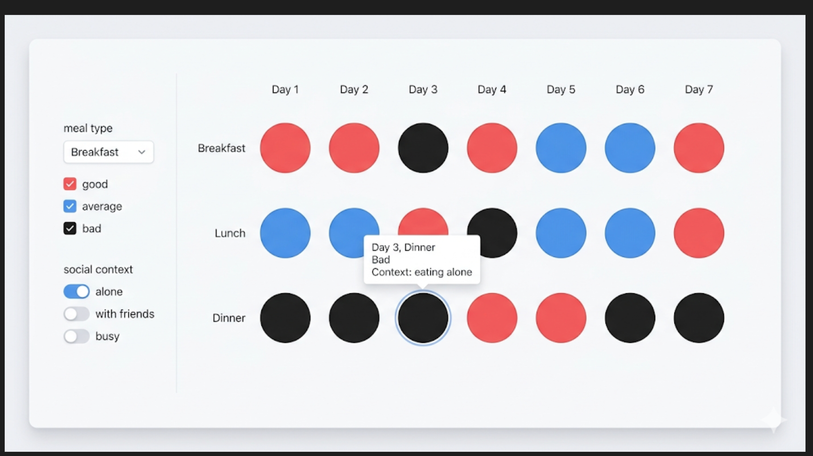
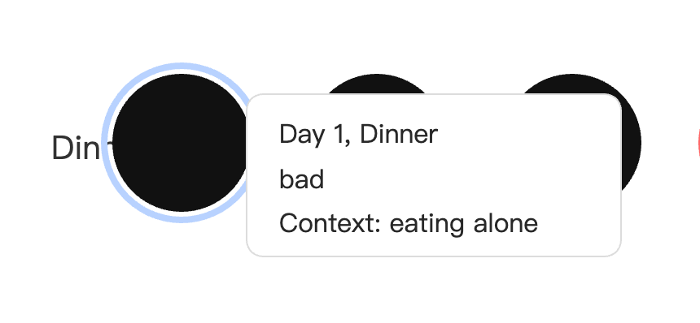
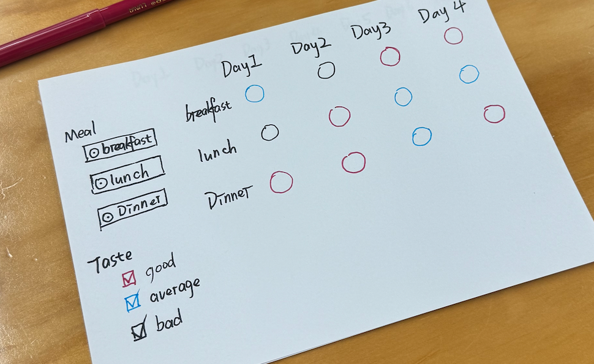
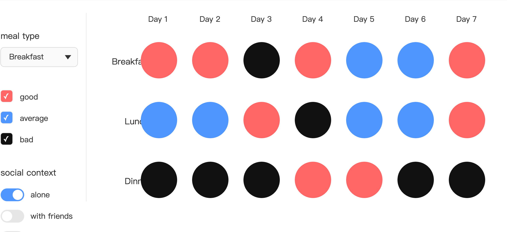

# Week 06

[← Back to Home](../index.md)

## In-Class Activities

### Data Exploration
**Data source：**   
The main data source will be self-collected data.I will record my meals over time, including satisfaction level, time, and whether I ate alone or with others.
The data is subjective, because it is based on personal judgement rather than objective measurement.
I may also simulate additional data to explore longer-term patterns.
So the dataset is small but personal, and that is intentional.

**Data contains and structures**
My data should be recorded in table form. I will record the following content: 
- timeline (for one week)
- meal type (Breakfast, lunch, dinner)
- Dining object (social context: alone, with others)
- mood
- Deliciousness (delicious, average, unpalatable)
- layers （such as emotions, social influence）

**Limitations and Biases** 

- It is highly subjective and cannot be generalized
- The records may be discontinuous or affected by recall bias
- The scoring of emotions and taste depends on self-perception

### Visual Research and Precedent Study 
#### Reference 1: Dear Data (Giorgia Lupi & Stefanie Posavec)

- **What draws you to it?**  
  They record small details of daily life by hand, full of human warmth.
- **What quality or approach might you carry forward?**  
  Translating subjective data into a poetic visual language, emphasising process over precision.
- **Does it change or reinforce your direction?**  
  Reinforces my idea of using a warm, handcrafted visual style for self-data.

#### Reference 2: The Happiness Project (Mona Chalabi)

- **What draws you to it?**  
  She uses simple, honest charts to tell personal emotional stories.
- **What quality or approach might you carry forward?**  
  Emotional data can be communicated very directly through colour and shape.
- **Does it change or reinforce your direction?**  
  Does not change my direction, but confirms that mood is a core variable.

#### Reference 3: Bloom (self-care app)
- **What draws you to it?**  
  Uses plant growth as a metaphor for mood and habit change.
- **What quality or approach might you carry forward?**  
  Layers can be expressed through stacked visual elements like petals or leaf veins.
- **Does it change or reinforce your direction?**  
  Inspires me to consider non-linear ways of representing time.

#### Reference 4: Your Flaws (by Karoline H. Larsen)

- **What draws you to it?**  
  She uses a body-scanning format to record self-criticism.
- **What quality or approach might you carry forward?**  
  Interaction could allow users to "choose which layer to view".
- **Does it change or reinforce your direction?**  
  Encourages me to keep raw notes as a hidden layer.

#### Reference 5: Life in a Day (Google & Ridley Scott)

- **What draws you to it?**  
  A timeline that brings together slices of life from countless people.
- **What quality or approach might you carry forward?**  
  Timeline + zoom interaction can reveal patterns in everyday routines.
- **Does it change or reinforce your direction?**  
  Strengthens my idea of using a vertical timeline and dot density to show meal frequency.

---

### Project Planning and Skills Roadmap
#### 3.1 What do I need to make?

I have created a digital sketch, but it is currently only a concept sketch and does not yet work.  

*(just a picture,can't work，generated by Chatgpt)*

#### 3.2 What do I need to learn? (Skills priority)

1. **Basic data binding and timeline implementation**  
   Use p5.js to map one week of meal data to circles on a timeline.

2. **Interactive selectors/filters**  
   Allow users to filter or highlight data by meal type (breakfast/lunch/dinner) and social context.

3. **"Layers" functionality**  
   Implement multiple overlapping layers (e.g., mood trend lines, social context markers). This is something I have not attempted before and will require focused learning.

4. **Responsive layout and user experience polish**  
   Make the exploration feel natural and reflective, fitting the "life diary" quality of the project.

#### 3.3 What are my next steps?
My next step is to refine the current prototype, as I feel it is still quite minimal and lacks depth in interaction and visual richness. I plan to record a full week of real meal data, including time, meal type, mood, satisfaction, and social context. This real dataset will help me test whether the current visual mapping (size = satisfaction, colour = taste) works as intended. I also want to explore how to visualise “layers” . I will start by implementing the basic timeline and circle layout, then gradually add filtering and layering functions. My goal is not just to show data, but to build a reflective experience where users (including myself) can explore patterns in everyday eating habits.

## Independent sStudy
During the proposal consultation, the most useful feedback I received was the need to clarify whether my final outcome would be digital or physical, and more importantly, *how* the data would be visually represented. This pushed me to think beyond just “a timeline with circles” and consider the actual user experience — is it a scrollable web page, an interactive app, or a printed diary?

The conversation did not change my core theme (personal food log as a reflective tool), but it sharpened my understanding of *format as meaning*. I realised that a digital interactive version allows for layering and filtering, which aligns perfectly with my idea of “layers of meaning”.

As a result, I will now focus on an interactive web-based prototype. I will iterate my visual model by recording one week of real data, and then test whether the visual mappings (size, colour, layering) actually help reveal patterns in mood and social context. This consultation helped me move from a vague concept to a testable, experience-driven direction.

### 2. Technical Skill Building
At first, I only created timeline and circles. Then, next, I tried adding layers to the pictures. Although this wasn't that simple, I still almost learned how to add layers to the graphics. Even with the help of Ai, I tried several times. But after completing this step, I found that my content was lacking something. Just these were a bit too little.
> **What I tried**:I have tried to add layers to the graphics.

### 3. Initial Concept Sketch Iteration
Based on the data I actively recorded last week, I drew a sketch, which roughly showed what my model looked like.
Based on the data I actively recorded last week, I drew a sketch, which roughly showed what my model looked like.But perhaps due to code issues, this basic model cannot run very well.

*a sketch i draw*

*a basic model*

## AI Usage Statement

This journal entry and the accompanying in‑class activities were developed with the support of a generative AI tool: **ChatGPT (OpenAI, GPT‑4 model)**. The AI was used as a thinking and writing assistant in the following specific ways:

- **Language and structure**: The AI helped me rephrase and organise my notes into clear, logically flowing sections, and convert the content into well‑formatted Markdown suitable for VS Code and GitHub Pages.
- **Clarifying key concepts**: I asked the AI to explain terms such as “data structure” and to help me articulate the relationship between my subjective data fields (mood, satisfaction, social context) and their planned visual encodings (size, colour, layering).
- **Generating visual precedent suggestions**: Based on a description of my project theme (personal meal logging, emotional tone, timeline, layers, interaction), the AI proposed a shortlist of relevant design and data visualisation examples. I then selected and curated the five references that felt most relevant to my direction, and wrote the responses about what draws me to each and what I might carry forward.
- **Expanding draft sections**: The AI provided initial drafts and structural templates for the “Next Steps” and “Consultation Reflection” sections, which I then revised significantly to reflect my own voice, actual plan, and specific feedback from my proposal consultation.

All AI‑generated text has been critically reviewed, edited, and in many cases rewritten by me. The final content—including project decisions, data audit, visual interpretations, and the personalised consultation reflection—represents my own thinking and work. The AI was used only to assist with articulation, organisation, and brainstorming; it did not generate the core ideas or project direction.

## References for Visual Precedent Studies

1. **Dear Data**  
   Lupi, G., & Posavec, S. (2016). *Dear Data*. Princeton Architectural Press.

2. **The Happiness Project**  
   Chalabi, M. (2018). Various data visualisations published in *The Guardian*.  
   https://www.theguardian.com/profile/mona-chalabi

3. **Bloom**  
   Bloom – Mental Health Tracker (mobile application). Referenced for its visual language of plant growth as a metaphor for emotional and behavioural patterns.  
   https://www.bloomapp.com (conceptual reference to app interface design)

4. **Your Flaws**  
   Larsen, K. H. (2019). *Your Flaws*. A personal data visualisation project.  

5. **Life in a Day**  
   Scott, R., & Macdonald, K. (Directors). (2011). *Life in a Day* [Motion picture]. YouTube / National Geographic. Referenced for its timeline‑based structure of aggregated daily moments.

