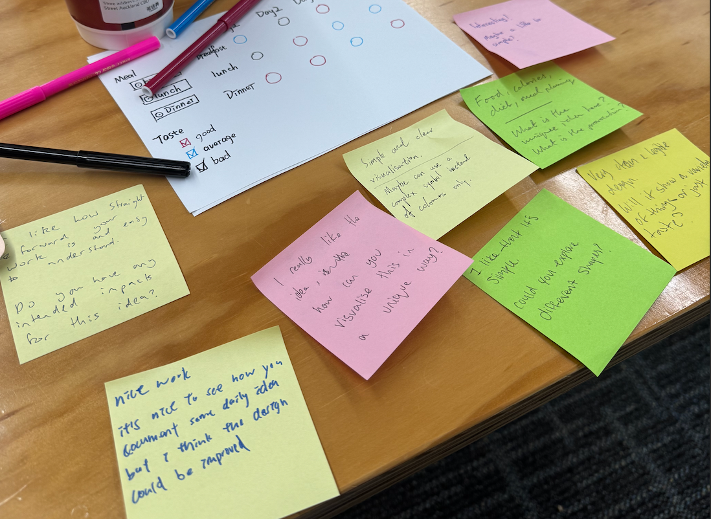
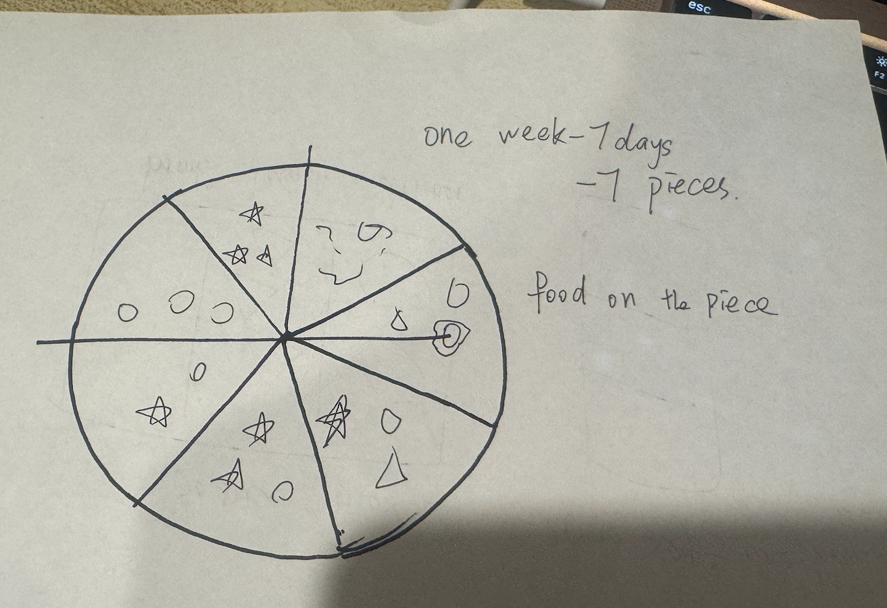
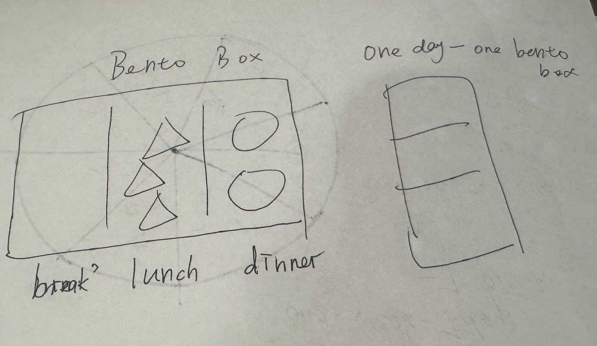
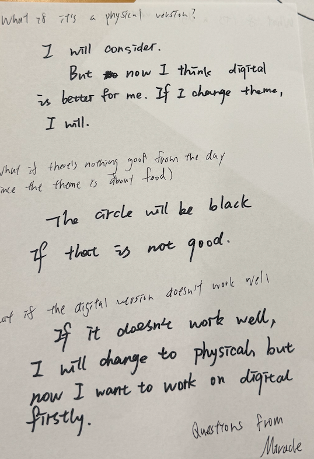
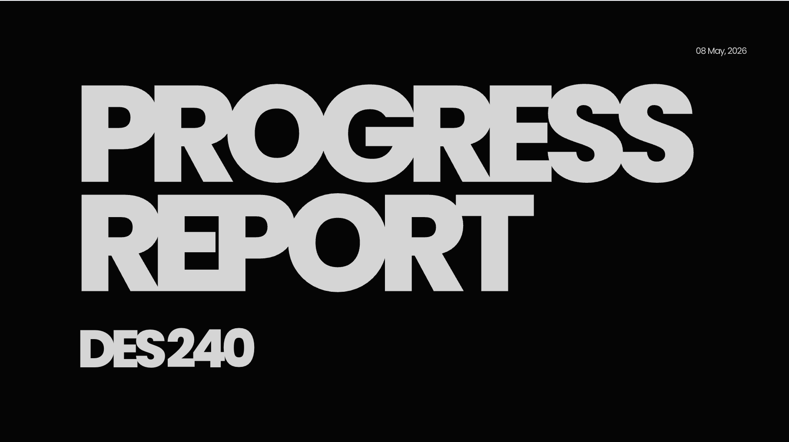
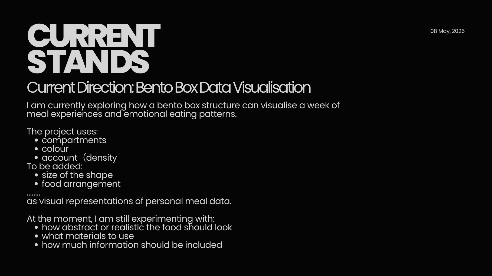
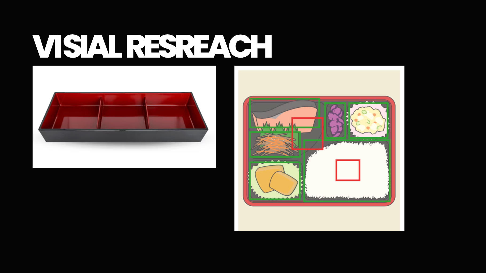
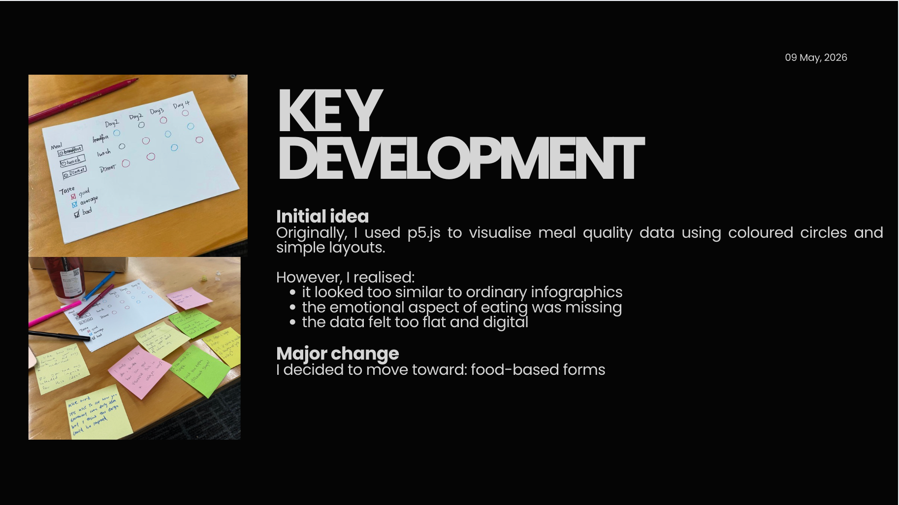

# Week 07

[← Back to Home](../index.md)

## In-Class Activities

### 1. Concept Sketches 

**Initial sketch idea**

#### Post-it Feedback Received

As classmates and the teacher walked around the room, the main feedback I received was:

- **Observation**: The model currently looks too simple; the visualisation lacks depth.
- **Question**: Can i use another way to show the data,and how can i add more things to let the project look not that simple.How will the complexity of the data be represented in such a simple model?

#### Reflection on Feedback

- **What surprised me**: Everyone agreed that it was "too simple" — this made me realise I need richer visual layers.
- **What aligned with my ideas**: I also felt the design only covered basic data mapping.
- **What to follow up on**: I need to explore a visual form that better fits the "food" theme.

---

### 2. Making Sprint 
#### Revised Sketch Direction

Based on the feedback, I decided to experiment with **food as a core visual metaphor**, because my data is related to food. 

**Initial ideas:If i use "pizza"**
- Number of pizza slices = 7 days of one week
- Size / colour of each slice = mood of the day
- Account of toppings = how many people eat with you 
- color of toppings = The taste of food 

#### Difficulties encountered
At first, I wanted to make a pizza, but I found that if I used pizza, it wouldn't be able to represent the three meals I had in a day in a more specific way, but rather it would be more like a general description of the day.Due to the irregularity of pizza, it is impossible to accurately display which day is which day, making visual reading rather difficult.

#### Idea changes

 After a period of brainstorming, I came up with the idea of using the bento box. Because the bento box is originally a container with compartments, dividing it into three compartments automatically represents the three meals of breakfast, lunch and dinner.

---

### 3. “What If” Variations 
**Format**: Pair work — propose 3 “what if” questions to each other.

#### Three “What If” questions I received and my answers

| What If Question | My Answer |
|----------------|-----------|
| 1. What if it is a physical version? | I would consider it, but for now I think a digital interactive version suits my project better because data updates daily. |
| 2. What if there is nothing good from the day? | Then the corresponding circle (or pizza slice) would turn black, representing "empty" or "no positive outcome". |
| 3. What if the digital version doesn't work well? | I would fall back to a physical version, but my current priority is to make the digital version work well first. |

#### One variation I chose to explore further

I chose **Question 1** as a direction:  
**“ What if it is a physical version?”**

##### Differences and new opportunities：

The questions raised by my classmates were mainly about physical or digital. I had a deep thought about this issue. I was thinking about how to make food materialized if I want to record it. 
- Draw the food you eat every day and put it together at the end? But this seems very complicated. If I have to draw like this every day, and every day I draw food, then what about the other information? How can I record it?
-  If I make a physical plate or lunch box, and then turn the food I eat every day into a small item and stick it on. But in this case, there's no novelty and the actual object might be a bit boring.

##### My final choice:
 If I use the digital one, at least it can make a very good dataset. So after the final thought, I still chose to use the electronic one.So i will keep make digital one.

---

## Independent Study Progress (after class)

### 1. Project Development & Skill Building

Based on the skills roadmap from Week 6, I focused on:

- **Visualization method reconstruction:** First of all, I completely gave up the initial simple geometric model and also abandoned the "pizza model", and switched to the current "bento box" model.

- **Technical learning:** Last week, I attempted to solve the problems I encountered before and successfully developed a p5.js model, which also resolved my previous technical issues. And this model contains the information I need. However, this week, after experiencing feedback, I found that the original model was not feasible. But at least I learned the technology, which might be useful in the future.
- **Data Preparation:** This week, I will refine my bento box data, record the data for the week, and figure out what data to use and exactly how to present it.

### 2. Progress Report (prepare for next week)

I have prepared a draft of 5 slides:

1. **cover page**

2. **Current project status**What i am exploring ,what it includ and what I am experimenting with.

3. **visual resreach**: some images that inspire me.

4. **key development**: My major progress is that I have changed the form. The previous one was too boring, too simple and too plain.

5. **What I hope to get from feedback**: Does the bento structure clearly convey the concept of visualization, and should I make it more tangible.

### Important Feedback
This is just a dataset of mine. What can this dataset do and what impacts will it have? The most important point is that I haven't given this thing any meaning. For instance, do I want to reflect on healthy eating through this, or what else? This is worth thinking about. This also gave me a great enlightenment. Before, I only focused on the content of the dataset and never thought about what the significance of this dataset was.
---

## Next Steps

- I will rethink the information of my bento box. 
- Try to endow this dataset with some meaning so that it can have some impact. 
-  When the previous elements have been refined, create the new ones using p5.js.

## AI Usage Statement

In completing this week’s journal entry, I used AI (ChatGPT / similar) for the following purposes:

- **Language and clarity**: I refined sentence structures and improved readability of my reflections and activity descriptions.
- **Organisation**: I asked AI to help format the markdown headings, tables, and lists according to the course journal template.
- **Idea articulation**: I discussed my “what if” variations and the shift from pizza to bento box with AI, which helped me clarify my reasoning and document my decision‑making process.

All conceptual development, sketches, data preparation, technical coding, and final decisions remain my own. The feedback from peers and the teacher, as well as my personal reflections, are reported faithfully based on my actual in‑class experience.
