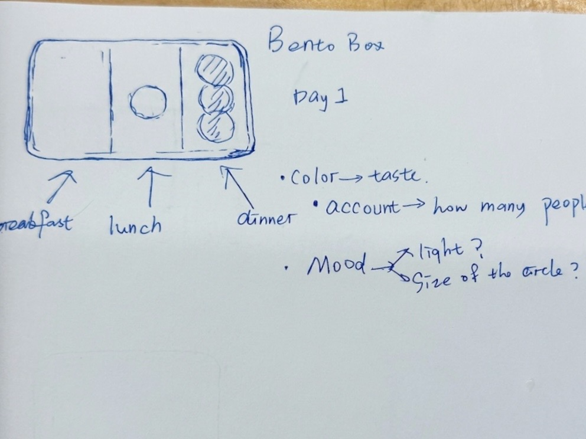
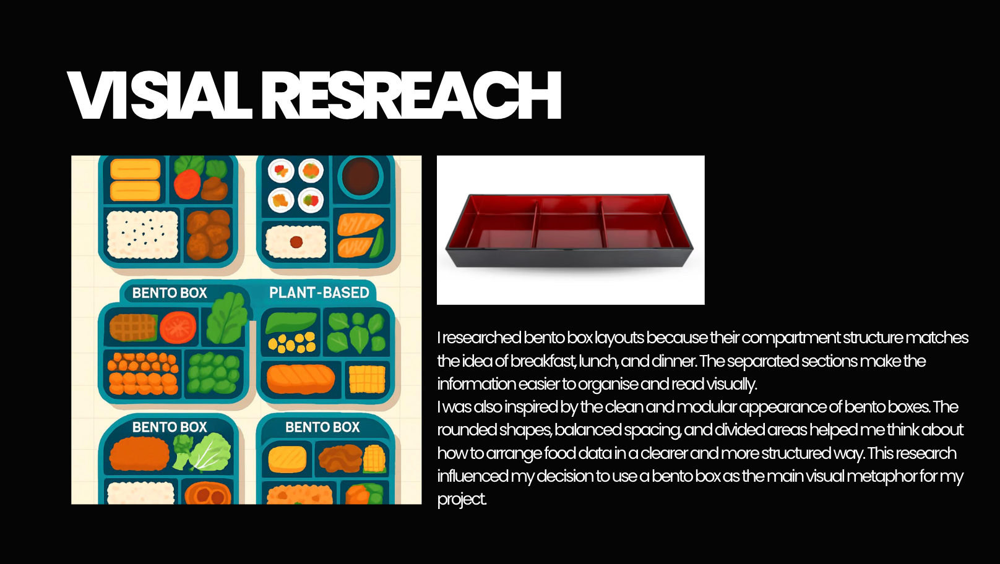
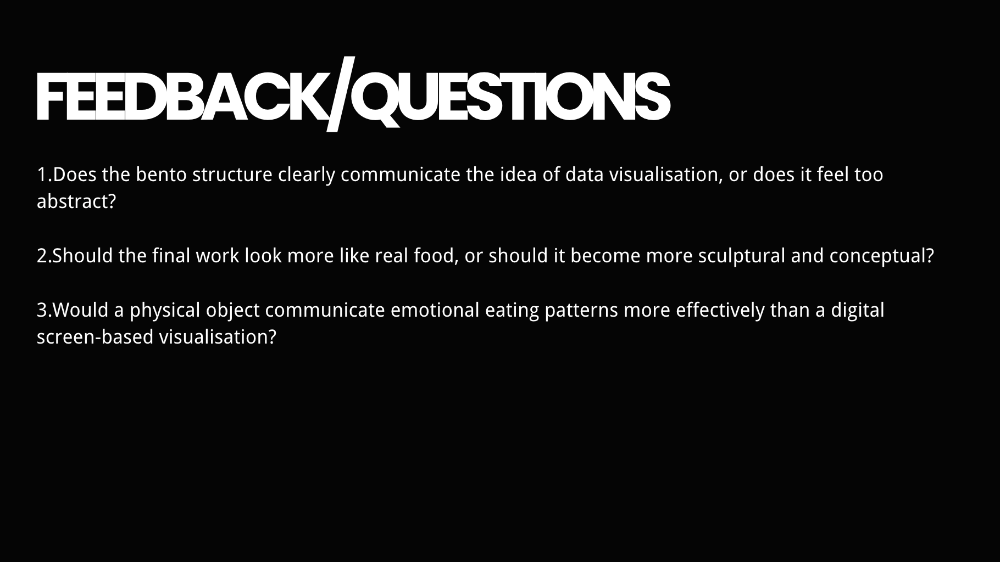
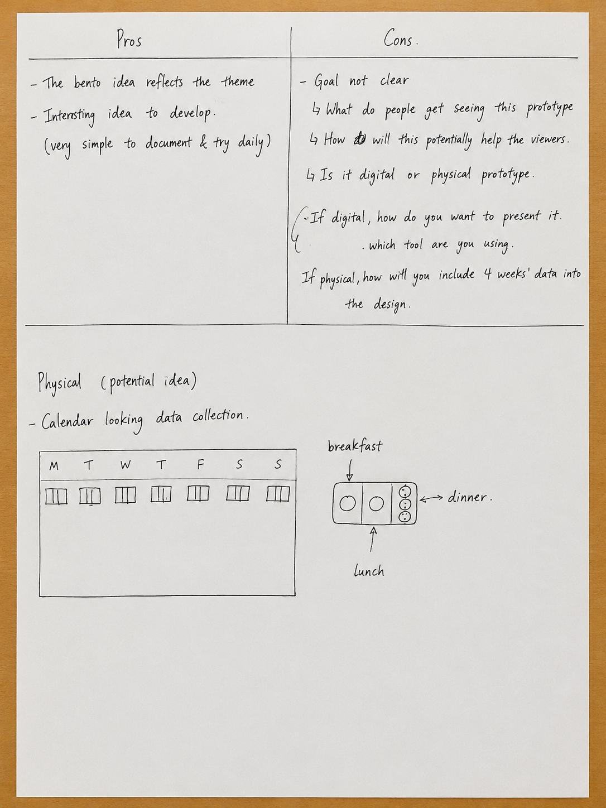
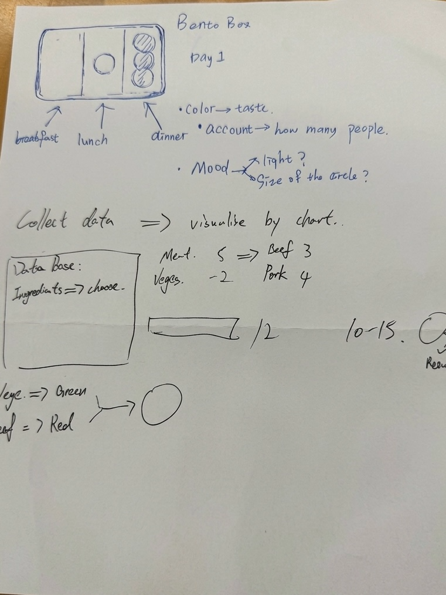
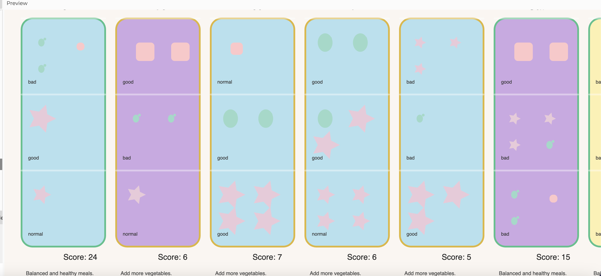

# Week 08

[← Back to Home](../index.md)

## In-class Activites
This week, I focused on developing the meaning and direction of my food-tracking visualisation project. During the progress presentation and group discussion, I received important feedback that made me realise my project was still only functioning as a dataset and lacked a clear purpose or impact. This pushed me to rethink what the project could actually do for users, such as encouraging healthier eating habits and providing health advice based on food data.

I also continued improving both the concept and technical side of the project. I refined the bento box system by adding food categories, scoring systems, and health suggestions, while also experimenting with a digital p5.js version of the visualisation. Although the current digital outcome still has problems with layout, overlapping graphics, and overall readability, this process helped me better understand the strengths and weaknesses of the design and gave me clearer directions for future development.
### Progress Reports
#### My Sketch

*The sketch I drew for the conception*
#### My power point

*cover page*

*Current project status*

*visual research*

*key development*

*What I hope to get from feedback*
#### Feedback
This week, I was assigned to a six-person group to share my progress with them and receive their feedback. During the speech, the teacher and the group members watched my presentation together. I received the following feedback:
>This is just one of my datasets. What can this dataset do? What impact will it have? Most importantly, I haven't given it any meaning yet. One of the group members gave me the advice that I could think about whether I wanted to use it to explore healthy eating or if there were other purposes? All of these are worth considering. This also enlightened me. Previously, I only focused on the content of the dataset and never thought about the significance of this dataset. So after this speech, I think it will be of great help to my project and I will come up with many new ideas.

### Critical Design Propositions
I found a partner. We took turns to briefly introduce our projects and the feedback we received to each other. Then we each began to provide design plans for each other's projects.
#### Critical thinkimg
I conducted critical thinking on my partner's work called "moments of joy".
- What aspect of their approach is most interesting?
 > First of all, both the theme and the way of expression are very interesting. Secondly, it transforms abstract and dynamic "emotional data" into a physical three-dimensional structure that can be touched and flipped through with both hands.
- What is least developed?
>Because this is a three-dimensional origami model, it leans more towards pure geometric aesthetics and lacks some data attributes.
- Is there an alternative form (e.g. physical, screen-based, interactive) that could strengthen the work?
>I think she could consider a form that combines "digital + physical". It doesn't seem so monotonous.
- How might their future scenario or intended impact be communicated more powerfully?
>She can try some diverse forms and clearly point out the social value or influence of this work.
- What else would you change or do differently if this were your project?
>/If it were me, I would try to combine data and numerical elements to add some sense of interaction. For example, using electronic ones to record data and the like.

**This is the feedback and design proposal given to me by my partner**

*Images with adjusted proportions by AI*

## Independent Study
### Reflective Summary（326 words）
First and foremost, the most crucial feedback: This point was mentioned both in the speech and in the sharing with my partner, meaning that this is just one of my datasets. I need to think about what this dataset can do? What impact will it have? How can we help the users? I didn't give it any meaning. One of the group members gave me a suggestion that I could consider whether I wanted to use it to explore healthy eating or for other purposes? All of these are worth considering. My partner also proposed a plan to transform this into a combination of numbers and physical entities, such as making a calendar table. However, this is not suitable for me. Maybe a digital one would be more appropriate. But other suggestions inspired me. Previously, I only focused on the content of the dataset and never considered its significance. So then I began to think and made some decisions. First of all, I figured out that the significance I would endow this with is to make it a healthy diet advice system, and I will provide a whole week's worth of data. And several crucial elements have been added. The first one is different types of food, which serve as the basis for judging a healthy diet. For instance, this will roughly be divided into three categories: meat, vegetables, and unhealthy food. Each category has its own score, some with bonus points and some with deduction points. Then these foods will be tallied and scored. The second point is that I have added health advice, providing health-related suggestions based on daily scores. The impact of this on my future projects is as follows: Firstly, this data has gained significance. It is not merely a dataset, nor is it just some simple graphs and a single piece of data. Moreover, different types of food have different ratings, and based on these ratings, people can receive health advice.
### Project Developmemt
#### Initial Idea


**Important Elements**
- Timeline — 7 days in a week
- Bento box compartments — 3 meals a day
- Number of icons — number of people eating
- Icon color — taste of the meal
- Box color — taste of the meal
- Each icon — different food, each with its own score
- Final score — health rating and health suggestion
#### Digital try
This was my digital ttempt , but after trying it out, I found that there were some problems with it. There are also some issues with the code, and so are the overall problems: the graphics jump around randomly and overlap, and the overall picture is messy and garish.

**Code snippet:**

```javascript
// Weekly Meal Health Tracker
// Interactive Bento Box Visualization
// P5.js

let weekData = [];
let dayNames = ["Mon", "Tue", "Wed", "Thu", "Fri", "Sat", "Sun"];

// FILTERS
let selectedMeal = "all";
let selectedTaste = "all";
let selectedFood = "all";

const colors = {
  green: "#a7d8ca",
  blue: "#bce0ed",
  yellow: "#fbf1b7",
  pink: "#e6cbd9",
  orange: "#f6c9ca",
  purple: "#c7aae0",
  gray: "#ebe4d5",
  bg: "#f9f6f2"
};

function setup() {
  createCanvas(1650, 950);
  textFont("Helvetica");

  generateData();

  // ---------- FILTER DROPDOWNS ----------

  // Meal filter
  mealSelect = createSelect();
  mealSelect.position(60, 40);
  mealSelect.option("all");
  mealSelect.option("breakfast");
  mealSelect.option("lunch");
  mealSelect.option("dinner");

  mealSelect.changed(() => {
    selectedMeal = mealSelect.value();
  });

  // Taste filter
  tasteSelect = createSelect();
  tasteSelect.position(240, 40);
  tasteSelect.option("all");
  tasteSelect.option("good");
  tasteSelect.option("normal");
  tasteSelect.option("bad");

  tasteSelect.changed(() => {
    selectedTaste = tasteSelect.value();
  });

  // Food filter
  foodSelect = createSelect();
  foodSelect.position(420, 40);
  foodSelect.option("all");
  foodSelect.option("meat");
  foodSelect.option("vegetable");
  foodSelect.option("fried");

  foodSelect.changed(() => {
    selectedFood = foodSelect.value();
  });
}

function draw() {

  background(colors.bg);

  drawTitle();

  let startX = 60;
  let startY = 140;

  let boxW = 190;
  let boxH = 520;
  let gap = 25;

  for (let i = 0; i < weekData.length; i++) {

    let x = startX + i * (boxW + gap);
    let y = startY;

    drawBentoBox(weekData[i], x, y, boxW, boxH);
  }
}

// -------------------------------------------------

function drawTitle() {

  fill(40);
  textAlign(CENTER);

  textSize(34);
  text("Weekly Meal Health Tracker", width / 2, 60);

  textSize(15);
  fill(90);

  text(
    "Explore meal health, food types, and eating patterns",
    width / 2,
    90
  );

  textAlign(LEFT);
  fill(60);

  textSize(14);

  text("Meal Filter", 60, 30);
  text("Taste Filter", 240, 30);
  text("Food Filter", 420, 30);
}

// -------------------------------------------------

function generateData() {

  for (let i = 0; i < 7; i++) {

    let day = {
      day: dayNames[i],
      mood: random(["happy", "neutral", "tired"]),
      meals: []
    };

    for (let j = 0; j < 3; j++) {

      let meal = {

        type: j === 0 ? "breakfast" :
              j === 1 ? "lunch" : "dinner",

        people: floor(random(1, 5)),

        foods: [],

        taste: random(["good", "normal", "bad"])
      };

      let foodCount = floor(random(1, 4));

      for (let k = 0; k < foodCount; k++) {

        meal.foods.push(
          random(["meat", "vegetable", "fried"])
        );
      }

      day.meals.push(meal);
    }

    weekData.push(day);
  }
}

// -------------------------------------------------

function drawBentoBox(day, x, y, w, h) {

  let healthScore = calculateHealth(day);

  let bgColor;

  if (day.mood === "happy") {
    bgColor = color(colors.yellow);
  }
  else if (day.mood === "neutral") {
    bgColor = color(colors.blue);
  }
  else {
    bgColor = color(colors.purple);
  }

  let borderColor;

  if (healthScore >= 10) {
    borderColor = color("#6bbf8f");
  }
  else if (healthScore >= 5) {
    borderColor = color("#d9b84f");
  }
  else {
    borderColor = color("#d96c6c");
  }

  // OUTER BOX
  stroke(borderColor);
  strokeWeight(4);

  fill(bgColor);

  rect(x, y, w, h, 25);

  // DAY LABEL
  noStroke();

  fill(40);

  textAlign(CENTER);

  textSize(24);

  text(day.day, x + w / 2, y - 20);

  // MEAL SECTIONS
  let sectionH = h / 3;

  for (let i = 0; i < 3; i++) {

    let meal = day.meals[i];

    // FILTER MEAL
    if (
      selectedMeal !== "all" &&
      meal.type !== selectedMeal
    ) {
      continue;
    }

    let sectionY = y + i * sectionH;

    stroke(255, 100);
    line(x, sectionY, x + w, sectionY);

    drawMeal(
      meal,
      x + 15,
      sectionY + 15,
      w - 30,
      sectionH - 30
    );
  }

  // HEALTH SCORE
  noStroke();

  fill(40);

  textSize(18);

  text(
    "Score: " + healthScore,
    x + w / 2,
    y + h + 30
  );

  // ADVICE
  textSize(12);

  fill(70);

  text(
    generateAdvice(healthScore),
    x + 10,
    y + h + 55,
    w - 20
  );
}

// -------------------------------------------------

function drawMeal(meal, x, y, w, h) {

  // TASTE FILTER
  if (
    selectedTaste !== "all" &&
    meal.taste !== selectedTaste
  ) {
    return;
  }

  let cols = 2;

  let spacingX = w / cols;

  for (let i = 0; i < meal.people; i++) {

    let px = x + (i % cols) * spacingX + 30;
    let py = y + floor(i / cols) * 60 + 40;

    let foodType = random(meal.foods);

    // FOOD FILTER
    if (
      selectedFood !== "all" &&
      foodType !== selectedFood
    ) {
      continue;
    }

    let size;

    // TASTE SIZE
    if (meal.taste === "good") {
      size = 42;
    }
    else if (meal.taste === "normal") {
      size = 28;
    }
    else {
      size = 18;
    }

    drawFoodShape(
      foodType,
      px,
      py,
      size
    );
  }

  // Taste label
  fill(50);

  textSize(11);

  textAlign(LEFT);

  text(
    meal.taste,
    x,
    y + h - 10
  );
}

// -------------------------------------------------

function drawFoodShape(type, x, y, s) {

  noStroke();

  // MEAT
  if (type === "meat") {

    fill(colors.orange);

    rect(x, y, s, s, 8);
  }

  // VEGETABLE
  else if (type === "vegetable") {

    fill(colors.green);

    ellipse(x, y, s * 0.8, s);

    ellipse(x + 8, y - 8, s * 0.35);
  }

  // FRIED / DESSERT
  else {

    fill(colors.pink);

    drawStar(x, y, 5, s * 0.4, s * 0.8);
  }
}

// -------------------------------------------------

function drawStar(x, y, points, r1, r2) {

  beginShape();

  for (let i = 0; i < points * 2; i++) {

    let angle = PI / points * i;

    let r = i % 2 === 0 ? r2 : r1;

    let sx = x + cos(angle) * r;
    let sy = y + sin(angle) * r;

    vertex(sx, sy);
  }

  endShape(CLOSE);
}

// -------------------------------------------------

function calculateHealth(day) {

  let score = 0;

  for (let meal of day.meals) {

    for (let food of meal.foods) {

      if (food === "meat") {
        score += 3;
      }

      if (food === "vegetable") {
        score += 5;
      }

      if (food === "fried") {
        score -= 2;
      }
    }
  }

  return score;
}

// -------------------------------------------------

function generateAdvice(score) {

  if (score >= 10) {
    return "Balanced and healthy meals.";
  }

  if (score >= 5) {
    return "Add more vegetables.";
  }

  return "Too much unhealthy food.";
}
```


#### Reflection and summary
Although this one didn't look well, the progress is that I'm trying to convert it into digital form and i can see the defects. Although there are some issues with the overall look and code, it's a good attempt. I will constantly adjust my thinking in the future to improve and continuously perfect the code. Enable p5.js to present a relatively good page state. 

## AI Usage Statement
During this week’s project development, I used the following AI tools to assist my work:

- **ChatGPT (OpenAI)** – I used it to help debug my p5.js code and suggest layout improvements for the bento box visualization.And it helped me adjust the photographed sketch into a clearer 3:4 composition, improving the layout and readability of the handwritten notes so the concept development process could be documented more clearly in my journal and presentation materials.

- **Claude (Anthropic)** – I used it to help simplify the drawing logic and generate a cleaner visual layout for the digital attempt.
- **DeepSeek (text assistant)** – I used it to refine my reflective summary and to help structure this AI usage statement.

All AI‑generated code snippets and textual suggestions were reviewed, adapted, and integrated by me. The final design, concept, and critical decisions remain my own original work.

