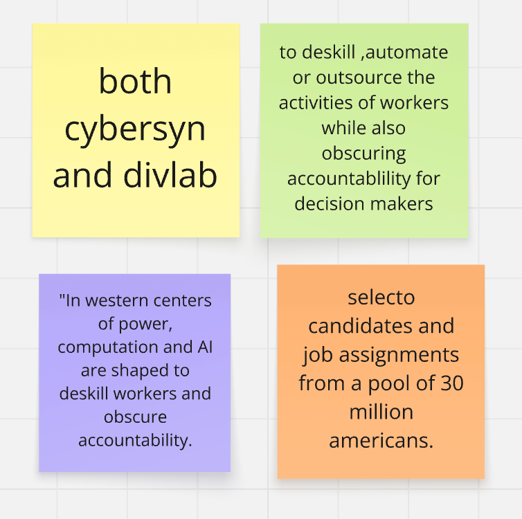

# Week 09

[← Back to Home](../index.md)

## In-class activities
### Project Statement: First Draft
#### Case study

- **What are the data sources used in this work?**
>both cybersyn and divlab
- **What is the future scenario it addresses?**
>to deskill ,automate or outsource the activities of workers while also obscuring accountablility for decision makers
- **What does the statement argue about data and power?**
>In western centers of power, computation and AI are shaped to deskill workers and obscure accountability.
- **What might be the intended impact, and is this included in the statement?**
>selecto candidates and job assignments from a pool of 30 million americans.

###
## Images & Media

*Use the format below to embed images from your assets folder:*

``
`*Your caption here*`

*The text inside the square brackets is alt text (a description for accessibility), not a visible caption. To add a caption, place a line of italic text below the image.*

## AI Usage Statement

*Document any use of AI tools under an AI Usage Statement heading. Explain which tools you used and describe how you used them. Reference any AI-generated content (see [QuickCite](https://auckland.libguides.com/referencing-generative-ai-tools) for guidance).*
