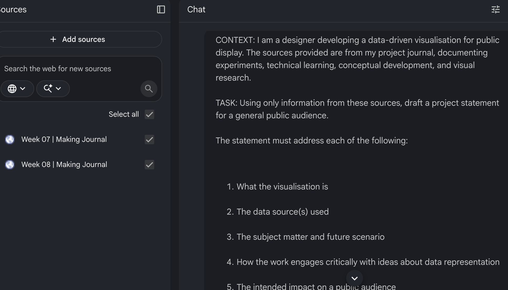
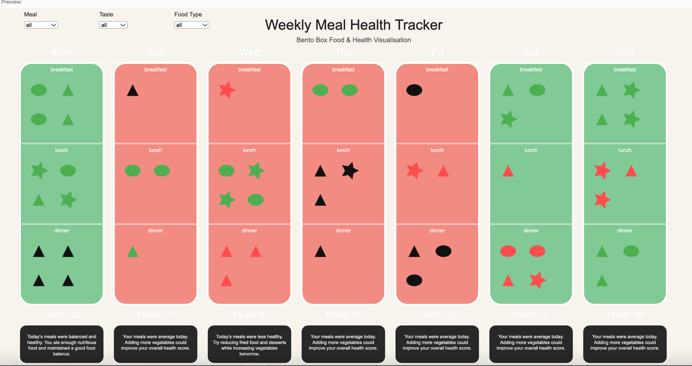
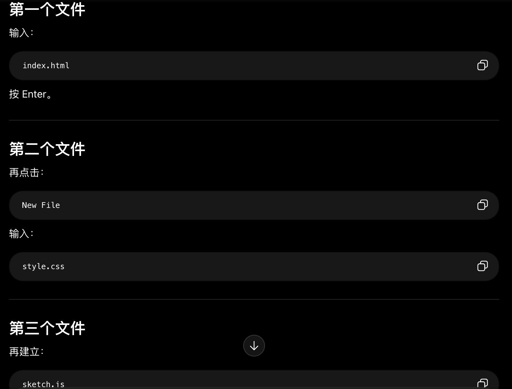

# Week 09

[← Back to Home](../index.md)

## In-class activities
### Project Statement: First Draft
#### Case study

- **What are the data sources used in this work?**
  >both cybersyn and divlab
- **What is the future scenario it addresses?**
  >to deskill ,automate or outsource the activities of workers while also obscuring accountablility for decision makers
- **What does the statement argue about data and power?**
  >In western centers of power, computation and AI are shaped to deskill workers and obscure accountability.
- **What might be the intended impact, and is this included in the statement?**
  >selecto candidates and job assignments from a pool of 30 million americans.

#### Drafting with NotebookLM
**Draft project statement**
I am developing the "Weekly Meal Health Tracker," an interactive digital visualisation that uses the **bento box** as a core visual metaphor to represent seven days of eating patterns. I chose the bento box because its natural compartments allow me to clearly represent the three specific meals of each day—breakfast, lunch, and dinner—in a way that is immediately legible. This work is built using p5.js and draws from a **personal dataset** I recorded over one week, tracking the types of food consumed, the taste of the meals, my mood, and the number of people I ate with.

The subject matter focuses on **healthy eating patterns**. In this system, different food types—categorised as meat, vegetables, or unhealthy foods—are assigned specific scores that contribute to a daily health rating. For instance, vegetables add bonus points while unhealthy foods result in deductions. I have also integrated qualitative data where the colour of each bento box reflects my daily mood (such as happy, neutral, or tired) and the size of food icons represents the quality of the taste.

Critically, this project represents a shift from simply mapping a "plain" dataset to **endowing data with significance**. By moving away from simple geometric models toward richer visual layers, I am exploring how a dataset can be transformed into a functional advice system. The intended impact is to move beyond mere documentation and encourage a public audience to reflect on the balance of their own diets. By presenting personal data in an engaging, interactive format, I hope to show how data can provide **practical health insights** and social value in our daily lives.

***

**Note on Underdeveloped Elements:** 
The journals identify the "future scenario" as the implementation of a "healthy diet advice system", but a broader societal or speculative future context for this scenario is not yet fully detailed.


#### Evaluation
1. **What are the strengths of this draft?**
   >The topic and goal of the project are very clear, so readers can quickly understand that this is a data visualisation project about healthy eating.
   The “bento box” is a strong visual metaphor, and it matches well with the structure of three meals a day.

2. **What is still missing or underdeveloped?**
   >The “future scenario” is still not very clear. Right now, it only mentions a healthy diet advice system, but it does not fully explain how people would use it in the future.
   The description of interaction is also not detailed enough. For example, it does not explain what users can click on, filter, or see changing on the screen.

3. **Which parts feel too general or “AI-generated”?**
   >The following expressions feel a bit too broad and generic, so they sound slightly AI-generated:“encourage a public audience to reflect on the balance of their own diets”“provide practical health insights and social value”

4. **What further research do you need to support your project?**
   >I need to research more case studies related to food tracking and health visualisation.
   I also need to explore how personal data visualisation can become meaningful for a wider public audience, instead of only working as a personal diary.

5. **Summarise your project direction in one sentence.**
   >My project uses an interactive bento box data visualisation to transform one week of food, mood, and health data into a health tracking system that encourages people to reflect on their eating habits.

#### peer share
1. **Which parts are clear and convincing?**
   >The overall concept is clear and easy to understand. The use of the bento box as a visual metaphor is convincing because it directly connects to the structure of daily meals.
   The project also combines both quantitative and qualitative data, which makes the visualisation more interesting and meaningful.
   In addition, the focus on healthy eating gives the project a clear purpose and makes it relatable to everyday life.

2. **What problems still need to be developed or solved?**
   >The future scenario still needs more development, especially explaining how this system could be used in real life in the future.
   The interaction design also needs to be explained more clearly, such as what users can interact with and how the system responds to user actions.
   Some descriptions are still too general, so adding more specific examples and personal insights could make the project feel more natural and less AI-generated.

### Making Sprint
#### My Plan

First, last week I identified the issues with my current p5.js development. The first problem is with my own planning, and the second is with the code. I will first refine this part.

Second, my plan is to turn this into a website. Within the website, users can see an introduction to the project, then view and interact with the p5.js model.

#### What my project needs most right now

The most important thing for me right now is to improve my p5.js code.

#### Addressing the challenges

I have refined my ideas:

1. To avoid a messy visual appearance, I defined clear, relatively simple icons — triangles represent vegetables, ellipses represent meat, and five‑pointed stars represent unhealthy food.

2. I adjusted the total score calculation:
   - 15+ = Healthy
   - 10–15 = Average
   - Below 10 = Unhealthy

3. The bento box colour represents the mood of the day, and the icon colour represents the taste level. This time I made them consistent: good = red, normal = green, bad = black. However, the brightness differs to make them distinguishable while avoiding too many colours that might confuse users.

4. Users can filter explicitly by meal type, taste level, or food category.

#### Solve the challenges
Based on the above content, I have continuously improved my code. And a decent version was obtained.

```javascript
// Weekly Bento Health Tracker
// P5.js
// NO MOVING ANIMATION VERSION

let weekData = [];
let dayNames = ["Mon", "Tue", "Wed", "Thu", "Fri", "Sat", "Sun"];

// FILTERS
let mealFilter = "all";
let tasteFilter = "all";
let foodFilter = "all";

// DROPDOWNS
let mealSelect;
let tasteSelect;
let foodSelect;

function setup() {

  createCanvas(1700, 980);
  textFont("Arial");

  generateData();

  // ---------------- FILTERS ----------------

  mealSelect = createSelect();
  mealSelect.position(60, 40);
  mealSelect.option("all");
  mealSelect.option("breakfast");
  mealSelect.option("lunch");
  mealSelect.option("dinner");

  mealSelect.changed(() => {
    mealFilter = mealSelect.value();
  });

  tasteSelect = createSelect();
  tasteSelect.position(240, 40);
  tasteSelect.option("all");
  tasteSelect.option("good");
  tasteSelect.option("normal");
  tasteSelect.option("bad");

  tasteSelect.changed(() => {
    tasteFilter = tasteSelect.value();
  });

  foodSelect = createSelect();
  foodSelect.position(420, 40);
  foodSelect.option("all");
  foodSelect.option("meat");
  foodSelect.option("vegetable");
  foodSelect.option("fried");

  foodSelect.changed(() => {
    foodFilter = foodSelect.value();
  });
}

function draw() {

  background("#f7f3ed");

  drawTitle();

  let startX = 50;
  let startY = 140;

  let boxW = 200;
  let boxH = 580;
  let gap = 25;

  for (let i = 0; i < weekData.length; i++) {

    let x = startX + i * (boxW + gap);
    let y = startY;

    drawBentoBox(weekData[i], x, y, boxW, boxH);
  }
}

// -------------------------------------------------

function drawTitle() {

  fill(30);
  textAlign(CENTER);

  textSize(34);
  text("Weekly Meal Health Tracker", width / 2, 60);

  textSize(16);
  fill(80);

  text(
    "Bento Box Food & Health Visualisation",
    width / 2,
    90
  );

  textAlign(LEFT);

  fill(40);

  textSize(14);

  text("Meal", 60, 28);
  text("Taste", 240, 28);
  text("Food Type", 420, 28);
}

// -------------------------------------------------

function generateData() {

  for (let i = 0; i < 7; i++) {

    let day = {

      day: dayNames[i],

      mood: random(["happy", "normal", "bad"]),

      meals: []
    };

    let mealNames = ["breakfast", "lunch", "dinner"];

    for (let j = 0; j < 3; j++) {

      let meal = {

        type: mealNames[j],

        people: floor(random(1, 5)),

        taste: random(["good", "normal", "bad"]),

        foods: []
      };

      let foodCount = floor(random(2, 5));

      for (let k = 0; k < foodCount; k++) {

        meal.foods.push(
          random(["meat", "vegetable", "fried"])
        );
      }

      day.meals.push(meal);
    }

    weekData.push(day);
  }
}

// -------------------------------------------------

function drawBentoBox(day, x, y, w, h) {

  let boxColor;

  // MOOD COLOR
  if (day.mood === "happy") {
    boxColor = "#f28b82"; // red
  }
  else if (day.mood === "normal") {
    boxColor = "#81c995"; // green
  }
  else {
    boxColor = "#444444"; // black
  }

  stroke(255);
  strokeWeight(4);

  fill(boxColor);

  rect(x, y, w, h, 28);

  // DAY TITLE
  noStroke();

  fill(255);

  textAlign(CENTER);

  textSize(24);

  text(day.day, x + w / 2, y - 18);

  let sectionH = h / 3;

  for (let i = 0; i < 3; i++) {

    let meal = day.meals[i];

    // FILTER: MEAL
    if (
      mealFilter !== "all" &&
      meal.type !== mealFilter
    ) {
      continue;
    }

    let sectionY = y + i * sectionH;

    stroke(255, 120);

    line(x, sectionY, x + w, sectionY);

    drawMeal(
      meal,
      x,
      sectionY,
      w,
      sectionH
    );
  }

  // HEALTH SCORE
  let score = calculateHealth(day);

  noStroke();

  fill(255);

  textSize(18);

  text(
    "Health: " + score,
    x + w / 2,
    y + h + 30
  );

  // HEALTH SUMMARY
  fill(40);

  rect(x, y + h + 50, w, 90, 15);

  fill(255);

  textSize(11);

  text(
    generateAdvice(score),
    x + 10,
    y + h + 72,
    w - 20
  );
}

// -------------------------------------------------

function drawMeal(meal, x, y, w, h) {

  // FILTER: TASTE
  if (
    tasteFilter !== "all" &&
    meal.taste !== tasteFilter
  ) {
    return;
  }

  // TASTE COLOR
  let shapeColor;

  if (meal.taste === "good") {
    shapeColor = "#ff4d4d"; // red
  }
  else if (meal.taste === "normal") {
    shapeColor = "#4caf50"; // green
  }
  else {
    shapeColor = "#111111"; // black
  }

  // MEAL LABEL
  noStroke();

  fill(255);

  textSize(13);

  textAlign(CENTER);

  text(
    meal.type,
    x + w / 2,
    y + 20
  );

  // DRAW SHAPES
  for (let i = 0; i < meal.people; i++) {

    let px = x + 45 + (i % 2) * 70;
    let py = y + 65 + floor(i / 2) * 70;

    let foodType = meal.foods[i % meal.foods.length];

    // FILTER: FOOD TYPE
    if (
      foodFilter !== "all" &&
      foodType !== foodFilter
    ) {
      continue;
    }

    fill(shapeColor);

    drawFoodShape(
      foodType,
      px,
      py,
      28
    );
  }
}

// -------------------------------------------------

function drawFoodShape(type, x, y, s) {

  noStroke();

  // MEAT = ELLIPSE
  if (type === "meat") {

    ellipse(x, y, s + 10, s);
  }

  // VEGETABLE = TRIANGLE
  else if (type === "vegetable") {

    triangle(
      x,
      y - s / 2,
      x - s / 2,
      y + s / 2,
      x + s / 2,
      y + s / 2
    );
  }

  // FRIED / DESSERT = STAR
  else {

    drawStar(
      x,
      y,
      5,
      s * 0.4,
      s * 0.8
    );
  }
}

// -------------------------------------------------

function drawStar(x, y, points, r1, r2) {

  beginShape();

  for (let i = 0; i < points * 2; i++) {

    let angle = PI / points * i;

    let r = i % 2 === 0 ? r2 : r1;

    let sx = x + cos(angle) * r;
    let sy = y + sin(angle) * r;

    vertex(sx, sy);
  }

  endShape(CLOSE);
}

// -------------------------------------------------

function calculateHealth(day) {

  let score = 0;

  for (let meal of day.meals) {

    for (let food of meal.foods) {

      if (food === "meat") {
        score += 3;
      }

      else if (food === "vegetable") {
        score += 5;
      }

      else if (food === "fried") {
        score -= 4;
      }
    }
  }

  return score;
}

// -------------------------------------------------

function generateAdvice(score) {

  if (score >= 15) {

    return "Today’s meals were balanced and healthy. You ate enough nutritious food and maintained a good food balance.";
  }

  else if (score >= 10) {

    return "Your meals were average today. Adding more vegetables could improve your overall health score.";
  }

  else {

    return "Today’s meals were less healthy. Try reducing fried food and desserts while increasing vegetables tomorrow.";
  }
}
```


### Round Ribin Rapid Reactions
This is a summary of the reactions I've heard from the audience: The current state of this model seems good, but does the user need a guide to make it clearer what each thing represents? Moreover, I can add more content. If it were just this p5.js model, everything would seem too monotonous. I can't just have one p5.js model. Their feedback made me even more certain that I would turn this into a website.

## Independent Study
### Project Development
During my independent study, I spent a long time researching the content of the website. Because various things need to be embedded, especially those related to p5.js, it is impossible to simply rely on markdown. First, I wrote out the initial text. This website might contain some text, but it's rather concise. I have a relatively good grasp of simple markdown at present, but for this part, I have relied on AI tools. Under its step-by-step guidance and assistance, I have made many attempts. The AI tool took many steps to explain to me what I should do. I admit that building a website is very difficult, even with the help of the AI tool.


*A screenshot of an Ai tool helping me*

My Reflection:

I think this is a major improvement. In the previous weeks, my project development mainly stayed at the p5.js model stage. It was only last week that I started to think about turning it into a website, especially after receiving feedback from visitors, which made this direction much clearer to me. I feel this is a qualitative improvement for the project.

This was also a very new attempt for me. Although I used AI tools to help during the process, it was still an important experiment and learning experience. One of the biggest difficulties for me was not only building the website itself, but also figuring out how to embed p5.js into the website properly. During this process, I asked both AI tools and more experienced friends for help.

What I gained from this experience is that, after many attempts and experiments, I successfully created a website and uploaded my project content onto it. During the process, I also adjusted some layouts and text content. The final success made me very happy because it clearly pushed my project forward in a significant way. At this stage, my project is no longer just a simple model — it has become a website that both presents the visual model and communicates the ideas behind it. Although I still think the website is incomplete, especially in terms of writing quality and richness of content, it is still an important step forward for my project.

<video src="../assets/week-09/MY FIRST WEBSITE.mp4" controls width="560"></video>

*A video showing my website*

### Progress Report
1.cover page

2.current stands

3.current stands

4.current draft project statement

5.key developments and decisions

6.visual research

7.feedback questions


## AI Usage Statement

During this week’s project development, I used the following AI tools:

- **ChatGPT (OpenAI)** – to help debug my p5.js code, suggest layout improvements for the bento box visualization, and teach me step by step how to create a website and embed the p5.js model into it.
- **DeepSeek (text assistant)** – to refine my reflective summary and help structure this AI usage statement.

All AI‑generated code snippets, website structure guidance, and textual suggestions were reviewed and integrated by me. The final design, concept, and critical decisions remain my own original work.

