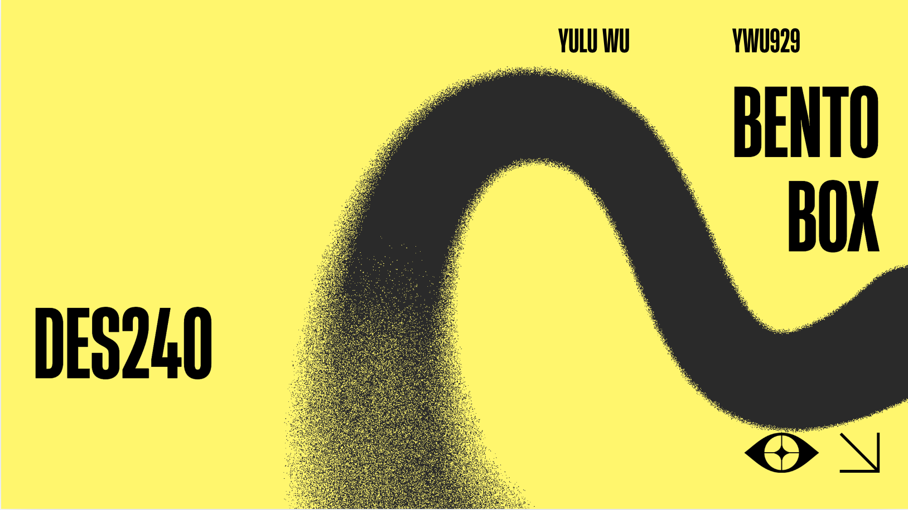
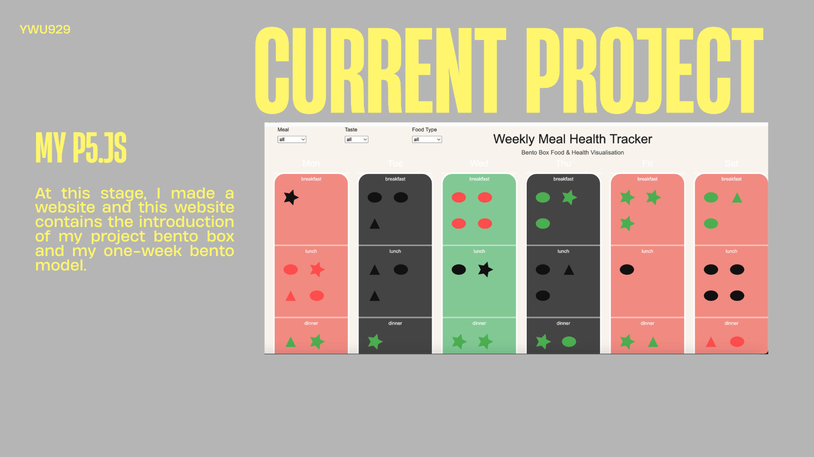
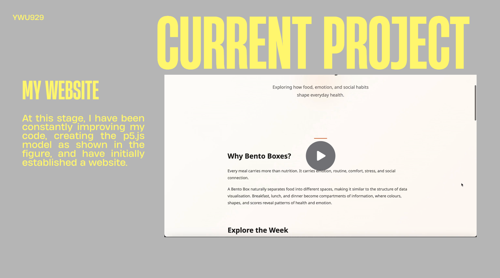
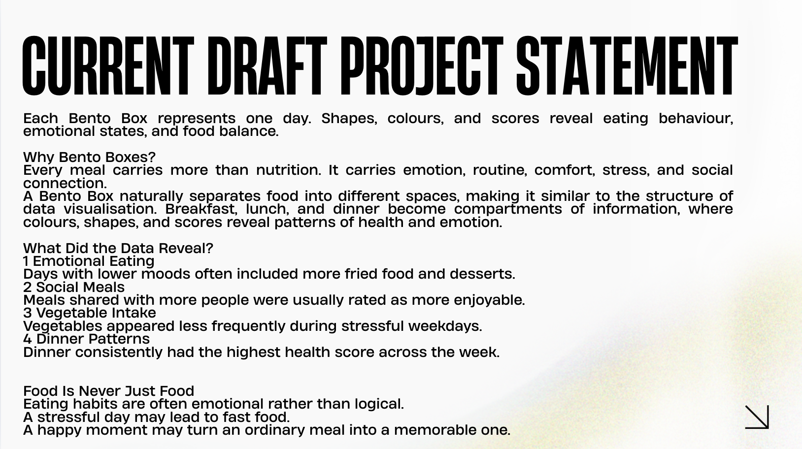
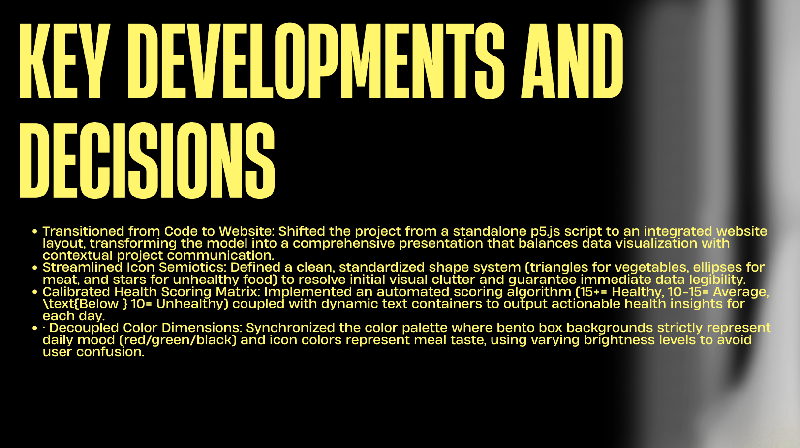
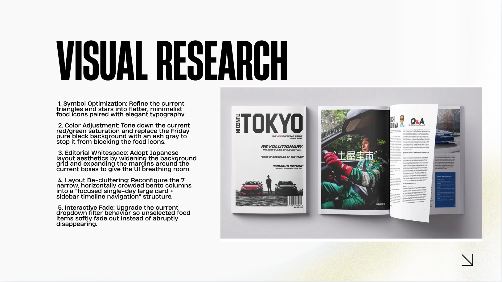
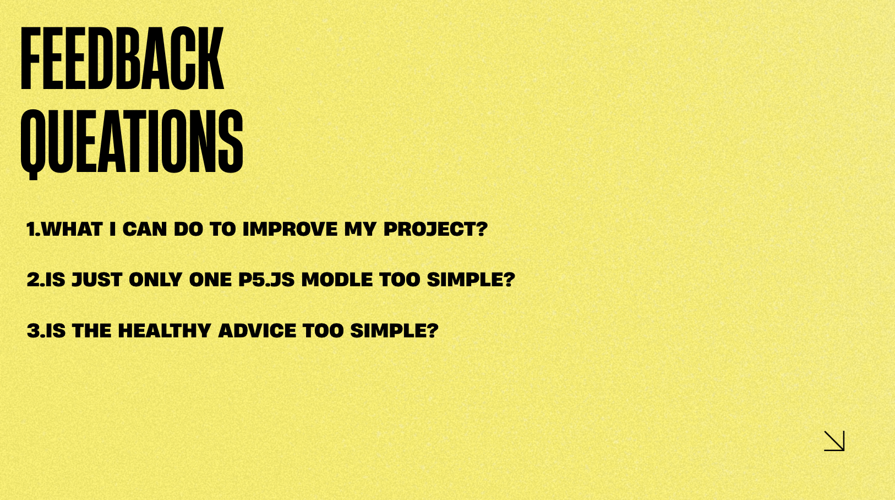
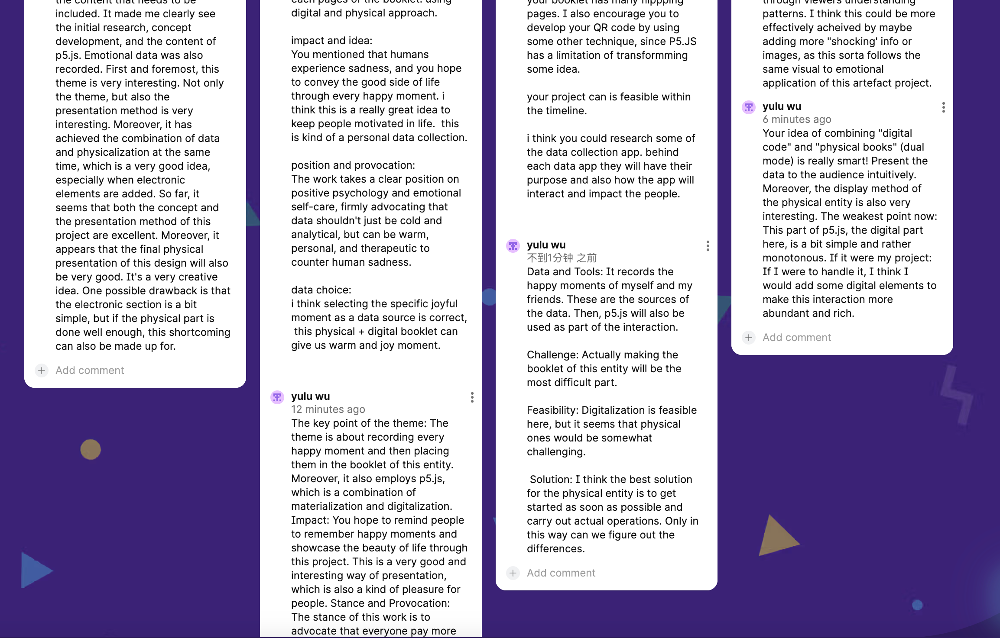
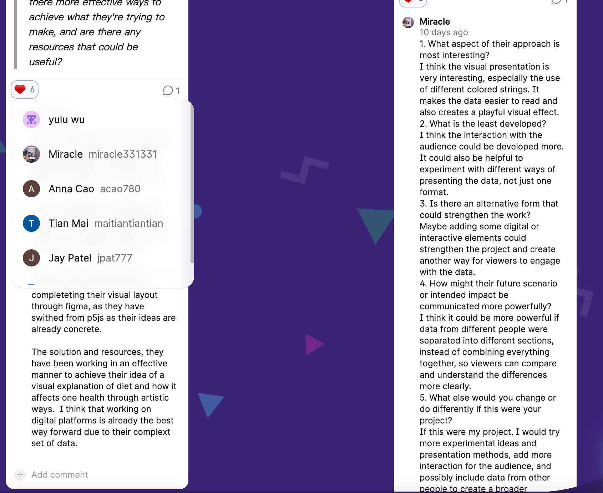
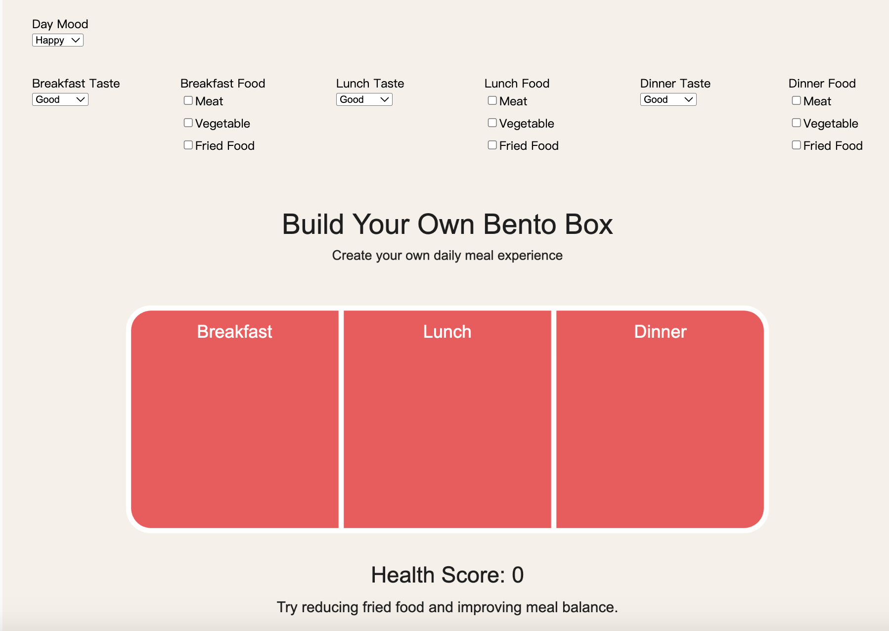

# Week 10

[← Back to Home](../index.md)

## In-class Activities
### Progress Reports
First of all, this is the content of my slides.
1.cover page

2.current stands

3.current stands

4.current draft project statement

5.key developments and decisions

6.visual research

7.feedback questions

### Gallery walk
I visited padlet, left comments on some people's works, read others' comments, and gave a thumbs-up to the ones I thought were good. 

*the comments i l have left*

*the comments i liked*

### Action Plan
**My reflection**
First of all, this project is no longer just a p5.js model.  It has now developed into a website, which makes the project much richer and more complete than before.  I see this as an important step forward.  Previously, most of my work focused on building and improving the p5.js visualisation itself, but now the project also includes written explanations, concept of the project, a p5.js modle and a website structure that helps communicate the concept more clearly to visitors.

However, there are still some important issues that need to be addressed.  At the moment, the p5.js visualisation is based entirely on my own personal dataset.  The food records, mood information, health scores, and feedback shown on the website all come from my own experiences.  As a result, users can only view and explore my data rather than actively participate in the system themselves.

After receiving feedback, I realised that the current level of interaction is still quite limited.  Users are mainly observers rather than contributors.  They cannot record their own meals, generate their own health scores, the bento box can not be thiers.  This raises an important question about how the project can become more useful and meaningful for a wider audience.

Moving forward, I need to think about how to make the system more accessible and interactive so that other people can use it with their own data.  This is something worth exploring further.  By the end of this week, I plan to consider possible solutions and investigate ways to make the project more engaging, participatory, and relevant for different users.
## Independent Study
### Project Development
#### My idea
After receiving the feedback, I started thinking about this important issue: how can I solve this problem and turn visitors to the website from viewers into active participants? After a lot of thinking, I came up with an idea that uses the variables I already have in my project. For example, meal type, daily mood, taste rating, food categories, health score, and health advice.

I think I can create an interactive bento box system. If I keep the seven-day format, the timeline becomes quite long. Instead, users could record their meals each day and interact with the system themselves. They could select different options for the variables, such as what they ate, how they felt, and how much they enjoyed the meal. The system could then calculate a score and provide health suggestions based on their choices. This would make the project more interactive and allow users to generate and explore their own data rather than only viewing mine.

### My process

After receiving feedback, I started thinking about an important question: how can I turn visitors to the website from viewers into active participants? At the moment, users can only explore my personal dataset, which means the interaction is still quite limited.

After some brainstorming, I decided to build on the variables that already exist in my project, including:

- Meal type
- Daily mood
- Taste rating
- Food categories
- Health score
- Health advice

I think an interactive bento box system could be a good solution. Instead of only showing my own seven-day dataset, users could record their meals day by day and generate their own data.

Users would be able to select and interact with different options, such as:

- What meal they are recording (breakfast, lunch, or dinner)
- Their mood for the day
- How much they enjoyed the meal
- The types of food they ate

Based on these selections, the system could automatically:

- Calculate a health score
- Generate personalised health advice

This would make the project much more interactive and meaningful. Rather than simply viewing my personal data, users would be able to create, explore, and reflect on their own eating patterns through the visualisation.

*the new additional p5.js model*

#### how this has moved your project forward
This new p5.js model will be added to the website on the basis of the original model that I have retained. After going through this, I effectively solved the problem of lack of interactivity, enabling users to record their diet through these very quick and convenient options, create their own bento boxes, and see their health scores and small suggestions. This is making the project meaningful and influential. Users are now more than just viewers.

## AI Usage Statement
During this week’s work I used the following AI tools:

- **ChatGPT (OpenAI):** I used ChatGPT to help refine the wording of my reflections and process descriptions, and to suggest ways to structure the interactive options for the bento box system based on the variables I had already identified (such as meal type, mood, and taste rating). All AI‑assisted text was reviewed and edited.

- **Grammarly:** I used Grammarly to check grammar, spelling, and clarity of the written content in this document.

No AI‑generated content was directly copied without significant modification. All ideas, design decisions, and final outputs remain my own, with AI tools used only for assistance and refinement.

