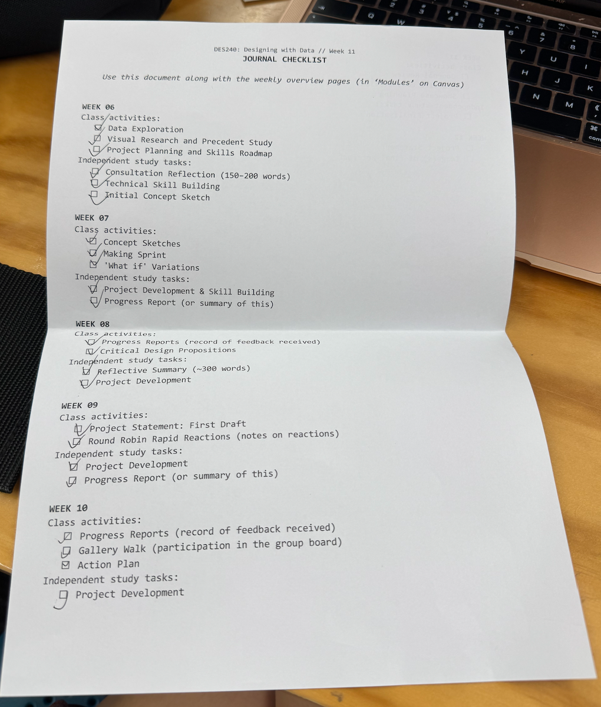
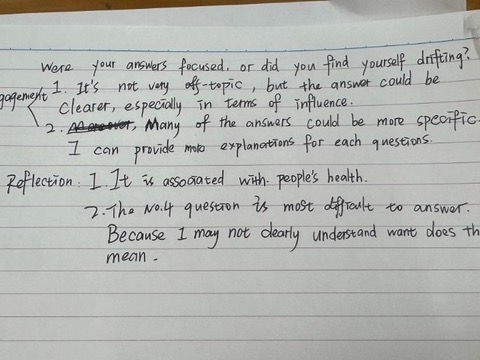
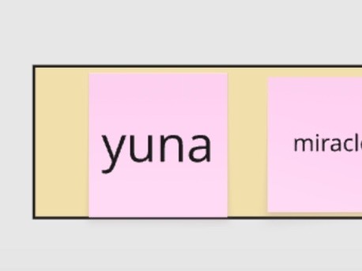
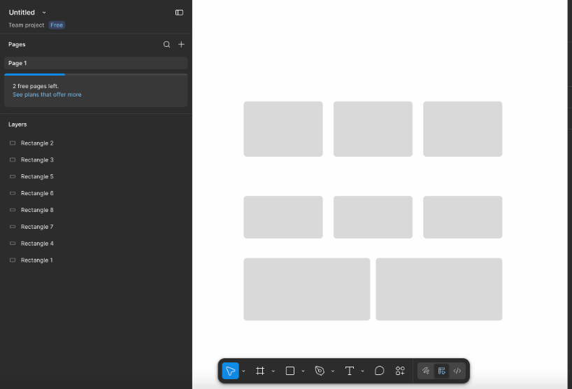
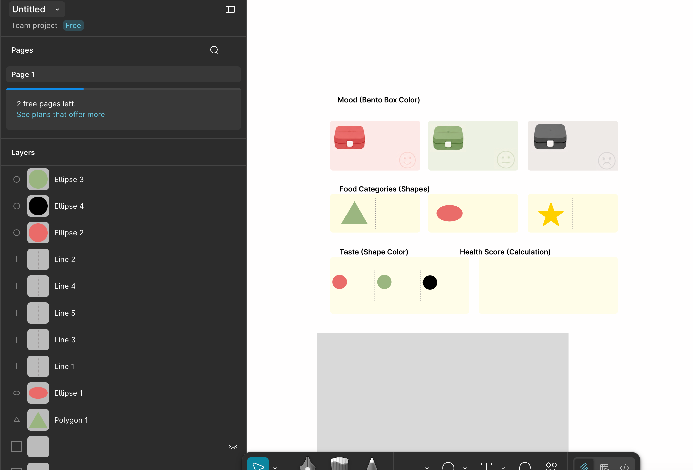
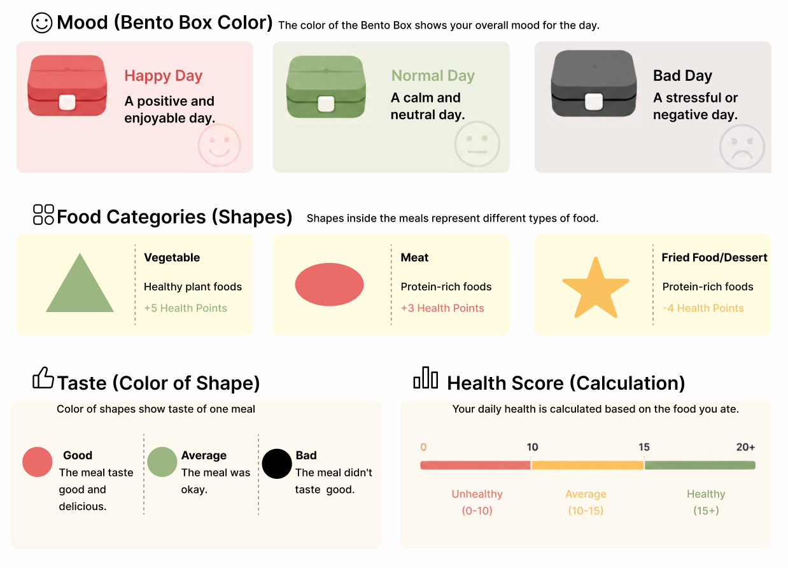
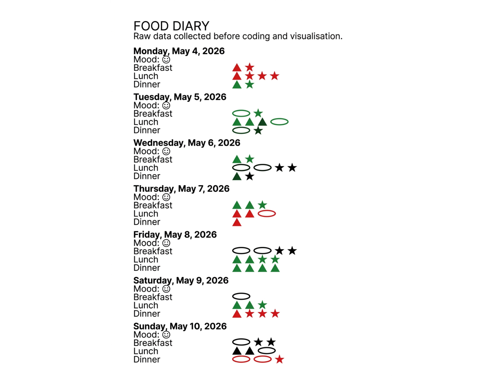
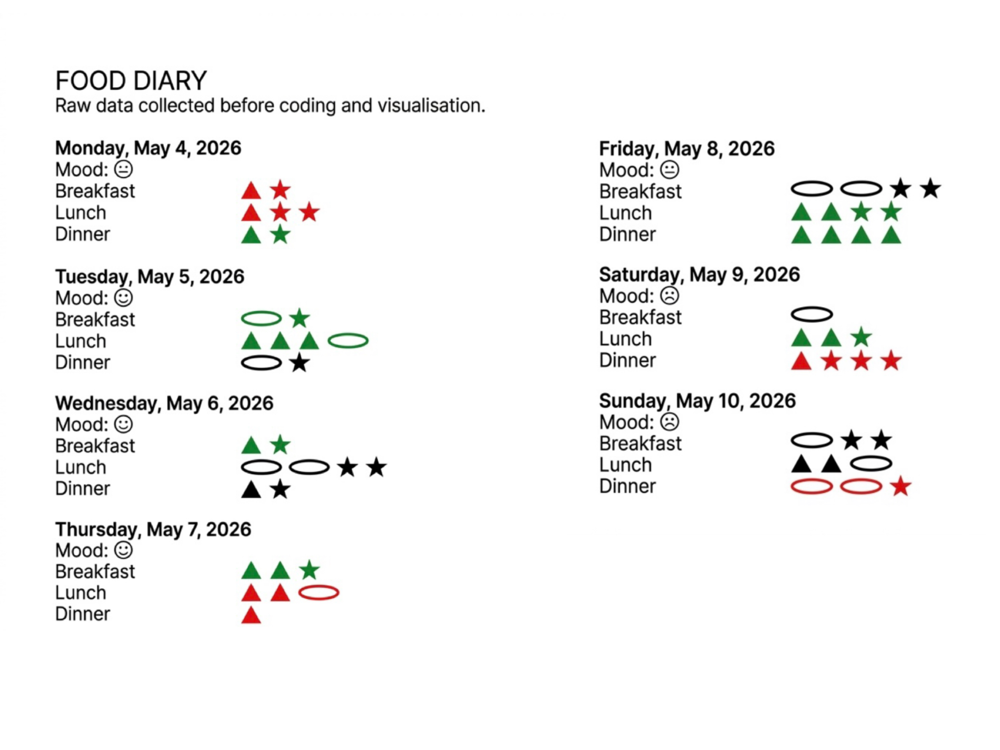

# Week 11

[← Back to Home](../index.md)

## In-class Acticivity
This week, I reviewed the log list from 6 to 10 weeks and reflected on three key moments that influenced the project: transforming the dataset into a health scoring system, embedding p5.js into the website, and changing users from observers to active participants. I conducted two practical consultations, raised structured questions, and critically reflected on the clarity and depth of my own answers. I also began to plan the exhibition. The project development is drawing to a close. During the final refinement stage, I will focus on the ultimate refinement and start planning the studio consultation. Based on the new interactive bento box model, I will enrich the website content.
### Journal Review
I confirmed the list for 6 to 10 weeks step by step and made sure it was all completed.

*my journal checklist*

**Three key moments:**

- The first key moment was when I realized that this project was merely a dataset. I didn't give it any meaning or make it have any impact, so I decided to turn it into a health scoring system.
- The second key moment was when I decided to turn my project into a website and embed p5.js. Previously, merely studying p5.js seemed very monotonous.
- The third key moment was when I realized that others were merely observers to this project, and I hoped to transform them into participants.

### practice Consultations
As required by the class, I conducted two studio consultations with two different people successively. Strictly follow the time requirements. As an interviewer, I also seriously raised questions.

**The questions are as follows**

-vTell me about your project’s theme.
- What is your data source? How did you access or collect it?
- Tell me about a key moment in your design journey.
- How does your work challenge conventional ideas?
- What impact do you want your visualisation to have?
- What surprised you most in the making process?

**Self reflection**
After the conversation, I made these reflections on my own answers.
- Engagement and coherence:
  >It's not very off-topic, but the answer could be Clearer, especially in terms of influence.
  
  >Many of the answers could be more specific.I can provide moto explanations for each questions.
- Reflection and criticality:
  >It is associated with  people’s health.
  
  >The No.4 question is most difficult to answer.Because I may not dearly understand want does this mean.

*what i wrote about reflection*
### Showcase Planning

*a screenshot that shows my name on miro*

## Independent Study
As the project's progress is coming to an end, this week's independent study will also be pushed into the final refinement stage of my project. And in the final moments, what I need to do is not only to refine my project, but also to carefully consider the content of the consultation for the studio.

Last week, after receiving feedback, I identified a very crucial issue and made a key decision. That is to say, how to turn people from observers into participants, making this project truly influential to people, rather than just observing my data. Last week, I also added a new p5.js model to my project after giving it a try. And this week I will also further improve on these.

**My idea of refine the project**

My current thought is that I believe the interaction aspect has improved significantly compared to before. Therefore, I need to make the content more refined. It's not just about text; I can also incorporate more visual elements. For example, visually display the contents and elements contained in the bento box to make people understand the bento box more clearly, or display the data of the mobile phone. But all of these are helping people better understand bento box. This is my enrichment of the content.

### What I do
After having the above ideas, the first step is to visualize the contents contained in the bento box. Like a menu, it enables users to better understand what the content is about, what it represents, and what the shape represents, rather than starting in confusion. So I used *figma* to help me complete this visual content.

*A screenshot of the process of making figma*

*A screenshot of the process of making figma*

*I created this Figma myself. The three coloured bento box images were generated using Gemini, and the small icons (e.g. smiley faces) are sourced from Flaticon.*

In addition, explanatory text was written to describe how to convert food diaries into data and how the bento box system conveys health and emotional patterns. These added contents make it easier for viewers who are not familiar with visual language to understand this project.

Finally, I continued to improve the overall structure of the website, focusing on telling stories rather than simply presenting data. This project now better explains the process from data collection to visualization and reflection, helping the audience understand the insights of design decisions and data revelation.

For the food diary, since it needs to be placed on the website in a consistent style, if it were my own handwritten manuscript, it would look too informal. Therefore, I used Ai to edit this picture.

*A picture modified and edited by ai.*

*I modified the proportion of the picture myself*
## AI Usage Statement

During this week’s work I used the following AI tools:

- **ChatGPT (OpenAI):** I used ChatGPT to help refine the wording of my reflections and independent study descriptions, and to suggest ways to enrich the visual presentation of the bento box content (e.g., displaying food items and data more clearly). All AI‑assisted text was reviewed and edited to fit my own voice and reasoning.
- **Gemeni:** I used Gemini to generate three images of bento boxes in different colors for the figma production.And i used Gemini to modify and edit my original picture and make it formal.
- **Grammarly:** I used Grammarly to check grammar, spelling, and clarity of the written content in this document.

No AI‑generated content was directly copied without significant modification. All ideas, design decisions, and final outputs remain my own, with AI tools used only for assistance and refinement.
